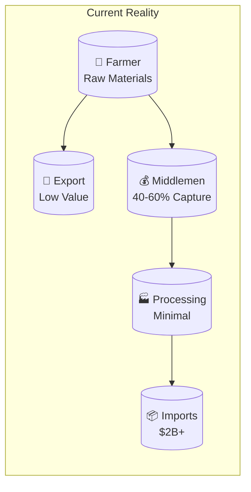
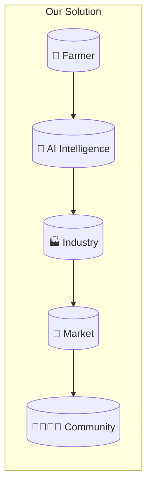
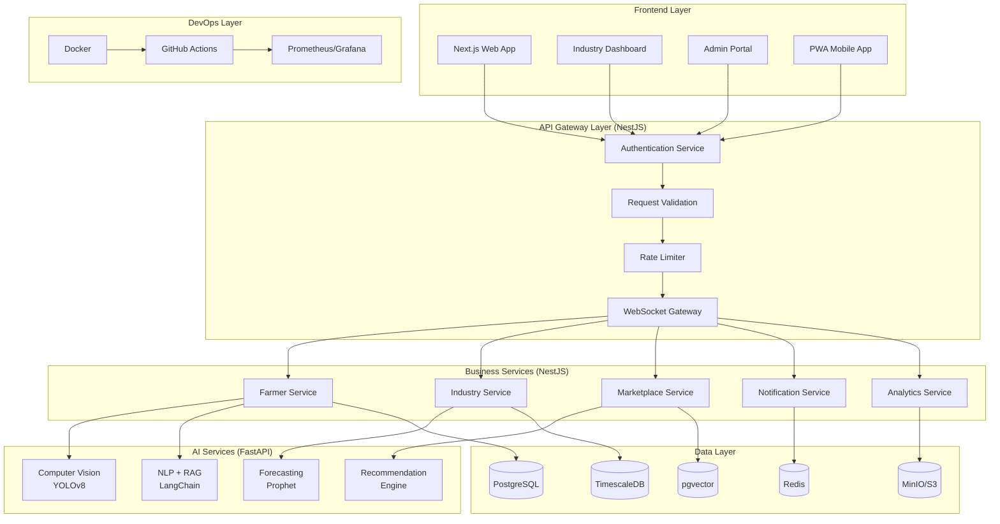
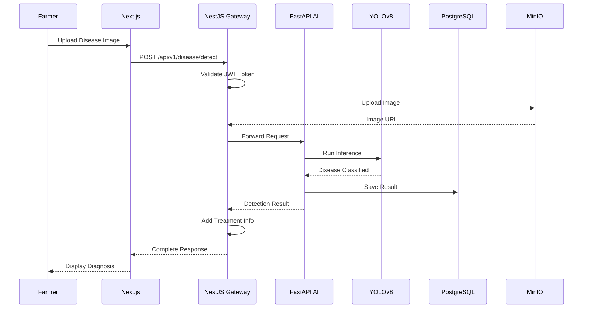
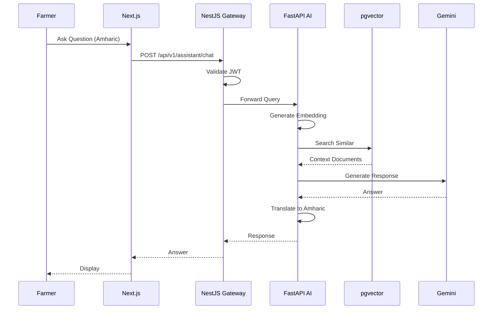
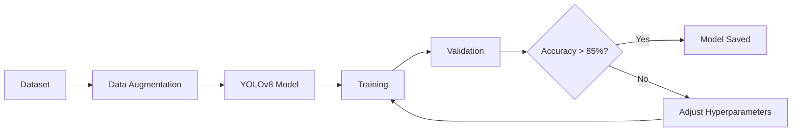
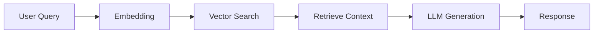
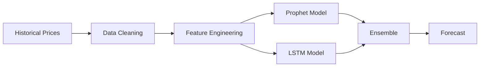

# 🌱 **AgroNexus AI**

<p align="center">
  <b>AI Operating System for Ethiopia's Agricultural Value Chain</b>
</p>

<p align="center">
  <i>From Soil to Shelf — Powered by Artificial Intelligence</i>
</p>

<p align="center">
  <a href="#"></a>
  <a href="#"></a>
  <a href="#"></a>
  <a href="#"></a>
  <a href="#"></a>
  <a href="#"></a>
  <a href="#"></a>
  <a href="#"></a>
  <a href="#"></a>
</p>

---

## 📖 **Table of Contents**

- [Overview](#-overview)
- [Why This Project Exists](#-why-this-project-exists)
- [The Problem We Solve](#-the-problem-we-solve)
- [Our Solution](#-our-solution)
- [System Architecture](#-system-architecture)
- [Features](#-features)
- [Technology Stack](#-technology-stack)
- [Project Structure](#-project-structure)
- [Quick Start](#-quick-start)
- [API Documentation](#-api-documentation)
- [Database Design](#-database-design)
- [AI Models](#-ai-models)
- [Deployment](#-deployment)
- [Roadmap](#-roadmap)
- [Contributing](#-contributing)
- [Authors](#-authors)
- [License](#-license)

---

## 🎯 **Overview**

**AgroNexus AI** is a production-grade artificial intelligence platform that bridges the critical gap between Ethiopian smallholder farmers and the agro-industrial sector. It creates a seamless value chain from **Agriculture → Industry → Markets** by democratizing access to AI-powered agricultural intelligence.

### **Our Vision**

> *"Transform Ethiopia from a raw material exporter to a manufacturing hub by making agricultural intelligence accessible to every farmer and connecting them directly to industry."*

### **Our Mission**

1. **Empower 1 million farmers** with AI tools by 2030
2. **Enable 1,000+ local agro-processors** to manufacture finished goods
3. **Reduce food imports by $500M** through import substitution
4. **Create 50,000+ jobs** across the agricultural value chain

---

## 🔥 **Why This Project Exists**

### **My Story**

I am Tsegay Assefa, a 3rd-year Information Science student at Addis Ababa University. Growing up in Ethiopia, I witnessed firsthand the struggles of smallholder farmers who form the backbone of our economy. I saw:

- Farmers losing 30-50% of their harvest to preventable diseases
- Families selling crops at rock-bottom prices while buying expensive imported goods
- Young people leaving agriculture because it offered no path to prosperity
- Billions of dollars leaving the country for food we could produce ourselves

### **The Gap I Identified**

Ethiopia's agriculture sector employs over **60% of the population** but contributes only **35% to GDP**. This massive value leak occurs because:

- **Information is trapped** - Farmers have no access to expert advice, market prices, or weather forecasts
- **Diseases go undetected** - Without early detection, diseases destroy entire harvests
- **Value is captured by middlemen** - 40-60% of profits never reach the farmer
- **Processing is minimal** - Raw materials are exported cheaply, finished goods are imported expensively

**This is not just an economic problem. It is a human problem.**

### **Why I Built This**

I built AgroNexus AI because:

1. **Technology can bridge the gap** - AI can detect diseases, predict prices, and connect people
2. **Every farmer deserves access** - Not just those near cities or with smartphones
3. **Ethiopia deserves self-sufficiency** - We have the resources, we need the intelligence
4. **This is my contribution** - Using AI engineering to solve real problems in my country

This project represents my commitment to using technology for social impact while building skills that will serve me throughout my career.

---

## 📊 **The Problem We Solve**

### **The Current Reality**



### **The Three Gaps**

| Gap | The Problem | The Impact |
|-----|-------------|------------|
| **Information Gap** | Farmers lack access to market prices, weather data, and expert advice | Farmers make decisions in the dark, losing money and harvests |
| **Disease Gap** | Without early detection, crop diseases spread unchecked | 30-50% of harvests lost annually to preventable diseases |
| **Value Chain Gap** | Farmers sell to middlemen who capture most of the value | 40-60% of profits never reach the farmer |

### **The Human Cost**

- **A farmer in rural Ethiopia**: Watches their teff crop die from rust because they couldn't identify it in time
- **A mother in Addis Ababa**: Buys expensive imported wheat flour because local processing doesn't exist
- **A young graduate**: Leaves the country because agriculture offers no future

**These are the problems AgroNexus AI exists to solve.**

---

## 🚀 **Our Solution**

### **The AgroNexus AI Platform**



### **How We Solve It**

| Problem | Our Solution | Technology |
|---------|--------------|------------|
| **Crop Diseases** | Instant diagnosis via photo upload | YOLOv8 Computer Vision |
| **Information Gap** | 24/7 AI assistant in local languages | LangChain + RAG + Gemini |
| **Price Volatility** | 30-day price forecasts | Prophet + LSTM |
| **Middlemen** | Direct farmer-processor marketplace | B2B Platform |
| **Import Dependency** | Local processing advisory | Factory Feasibility AI |
| **Data Gap** | Real-time economic dashboards | Impact Tracker |

---

## 🏗️ **System Architecture**

### **Overall System Design**


## 🗄️ **Database Design**

### **ER Diagram**

```mermaid
erDiagram
    Users ||--o{ FarmerProfiles : has
    Users ||--o{ ProcessorProfiles : has
    Users ||--o{ ConsumerProfiles : has
    Users ||--o{ DiseaseDetections : has
    Users ||--o{ ChatHistory : has
    
    FarmerProfiles ||--o{ Crops : grows
    ProcessorProfiles ||--o{ MarketListings : creates
    ProcessorProfiles ||--o{ Products : manufactures
    
    Crops ||--o{ PriceHistory : has
    Crops ||--o{ DiseaseDetections : has
    Crops ||--o{ Predictions : has
    
    MarketListings ||--o{ Orders : contains
    Orders ||--o{ Payments : has
    Products ||--o{ QualityReports : has

    Users {
        uuid id PK
        string name
        string email
        string phone
        string password_hash
        user_role role ENUM
        string language
        boolean is_verified
        timestamp created_at
        timestamp updated_at
    }

    FarmerProfiles {
        uuid user_id PK FK
        decimal farm_size
        geometry location
        jsonb crops
        uuid cooperative_id
        timestamp created_at
    }

    ProcessorProfiles {
        uuid user_id PK FK
        string company_name
        decimal capacity
        array crops_accepted
        geometry location
        boolean verified
        timestamp created_at
    }

    ConsumerProfiles {
        uuid user_id PK FK
        text address
        jsonb payment_methods
        timestamp created_at
    }

    Crops {
        uuid id PK
        string name
        string variety
        string season
        decimal min_price
        decimal max_price
        text image_url
        array disease_tags
        timestamp created_at
    }

    DiseaseDetections {
        uuid id PK
        uuid user_id FK
        uuid crop_id FK
        text image_url
        string disease_name
        decimal confidence
        text treatment_am
        text treatment_en
        text treatment_om
        text treatment_ti
        jsonb recommendations
        timestamp created_at
    }

    PriceHistory {
        timestamp time PK
        uuid crop_id FK
        string region
        decimal price
        string market
    }
```
### **Request Flow: Disease Detection**


### **Request Flow: AI Chat Assistant**



---

## ✨ **Features**

### 🌾 **Farmer Zone**

| Feature | Description | Technology | 
|---------|-------------|------------|
| **Disease Detection** | Upload crop photo → Instant diagnosis → Treatment | YOLOv8 + PyTorch |
| **AI Assistant** | 24/7 farming advice in local languages | LangChain + RAG + Gemini | 
| **Price Prediction** | 30-day forecasts with confidence intervals | Prophet + LSTM | 
| **Weather Alerts** | Hyperlocal 5-day weather forecasts | OpenWeather API | 
| **Cooperative Hub** | Connect with nearby farmers automatically | Recommendation Engine | 
| **Quality Grading** | Automatic crop grading for export | Computer Vision | 

### ⚙️ **Industry Zone**

| Feature | Description | Technology | 
|---------|-------------|------------|
| **Factory Feasibility** | Assess crop-to-product manufacturing viability | Decision Engine | 
| **Equipment Sourcing** | Connect buyers with local equipment sellers | Marketplace Platform | 
| **Quality Control AI** | Automated export-standard product grading | Computer Vision | 
| **Processing Guides** | Step-by-step guides in local languages | RAG + CMS | 
| **Cost Calculator** | Manufacturing cost and ROI analysis | Python + Pandas | 
| **Energy Optimization** | Solar/biofuel recommendations | Optimization Algorithms | 

### 🤝 **Market Zone**

| Feature | Description | Technology | Status |
|---------|-------------|------------|--------|
| **B2B Marketplace** | Direct farmer-to-processor connections | Next.js + PostgreSQL | 
| **Product Catalog** | Discover Ethiopian-made products | E-commerce Platform | 
| **Export Documentation** | Auto-fill export forms and certifications | Document AI | 
| **Impact Tracker** | Real-time economic impact visualization | Recharts + D3.js | 
| **Consumer Portal** | Buy local products, works offline | PWA + Offline-first | 
| **Price Comparison** | Compare local vs imported prices | Web Scraping + ML | 

---

## 📦 **Technology Stack**

### **Frontend**

| Layer | Technology | Purpose |
|-------|------------|---------|
| Framework | Next.js 15 + TypeScript | React with SSR |
| Styling | Tailwind CSS + shadcn/ui | Utility-first UI |
| State | Zustand + TanStack Query | Client + Server state |
| Forms | React Hook Form + Zod | Form validation |
| Charts | Recharts + D3.js | Data visualization |
| Maps | Mapbox GL / Leaflet | Location services |
| Mobile | PWA + React Native | Cross-platform |
| i18n | react-i18next | Amharic, Oromo, Tigrinya |

### **Backend Business (NestJS)**

| Layer | Technology | Purpose |
|-------|------------|---------|
| Framework | NestJS 10 | Enterprise backend |
| ORM | Prisma | Type-safe database |
| Auth | JWT + RBAC | Authentication & authorization |
| Validation | class-validator + Zod | Input validation |
| Queues | BullMQ + Redis | Background jobs |
| Real-time | WebSockets + Socket.io | Chat & notifications |
| API Docs | Swagger/OpenAPI | Interactive documentation |

### **AI Services (FastAPI)**

| Layer | Technology | Purpose |
|-------|------------|---------|
| Framework | FastAPI | High-performance API |
| Vision | YOLOv8 + PyTorch + OpenCV | Object detection |
| NLP | LangChain + FAISS + Gemini | RAG chatbot |
| Forecasting | Prophet + LSTM | Time series |
| MLOps | MLflow + DVC | Model tracking |
| Serving | ONNX Runtime | Model optimization |

### **Database**

| Database | Purpose | Technology |
|----------|---------|------------|
| Primary | User data, transactions | PostgreSQL 16 |
| Time-Series | Price data, forecasts | TimescaleDB |
| Vector | Embeddings for RAG | pgvector |
| Cache | Sessions, rate limiting | Redis |
| Storage | Images, documents | MinIO / S3 |

### **DevOps**

| Layer | Technology | Purpose |
|-------|------------|---------|
| Containerization | Docker + Compose | Environment consistency |
| CI/CD | GitHub Actions | Automated testing & deployment |
| Hosting | Vercel / Render / AWS | Application hosting |
| Monitoring | Prometheus + Grafana | Observability |
| Logging | ELK Stack | Centralized logging |

---

## 📁 **Project Structure**

```
agronexus-ai/
│
├── backend/                          # 🐍 FastAPI AI Service
│   ├── app/
│   │   ├── __init__.py
│   │   ├── main.py                  # Application entry point
│   │   ├── database.py              # Database connection & session
│   │   ├── models/                  # SQLAlchemy ORM models
│   │   │   ├── __init__.py
│   │   │   ├── user.py              # Unified user model with role
│   │   │   ├── farmer_profile.py    # Farmer-specific data
│   │   │   ├── processor_profile.py # Processor-specific data
│   │   │   ├── consumer_profile.py  # Consumer-specific data
│   │   │   └── disease.py
│   │   ├── schemas/                 # Pydantic schemas
│   │   │   ├── __init__.py
│   │   │   └── auth.py
│   │   ├── routes/                  # API endpoints
│   │   │   ├── __init__.py
│   │   │   ├── auth.py
│   │   │   ├── disease.py
│   │   │   └── role_guard.py
│   │   ├── services/                # Business logic layer
│   │   │   ├── __init__.py
│   │   │   ├── auth_service.py
│   │   │   ├── disease_service.py
│   │   │   └── disease/
│   │   │       └── detector.py      # YOLOv8 model loader
│   │   └── utils/
│   │       └── __init__.py
│   ├── models/                      # Trained ML models
│   │   └── disease_detection.pt
│   ├── requirements.txt
│   ├── Dockerfile
│   └── .env
│
├── frontend/                         # 🎨 Next.js Application
│   ├── app/
│   │   ├── (public)/                # Public website (no auth)
│   │   │   ├── page.tsx             # Landing page
│   │   │   ├── solutions/
│   │   │   ├── about/
│   │   │   └── layout.tsx
│   │   ├── (auth)/                  # Auth pages
│   │   │   ├── login/page.tsx
│   │   │   └── register/page.tsx
│   │   ├── (dashboard)/             # Protected portal
│   │   │   ├── layout.tsx           # Dashboard layout
│   │   │   ├── farmer/
│   │   │   │   ├── page.tsx         # Farmer dashboard
│   │   │   │   ├── disease/
│   │   │   │   ├── chat/
│   │   │   │   └── prices/
│   │   │   ├── processor/
│   │   │   │   ├── page.tsx
│   │   │   │   └── procurement/
│   │   │   └── consumer/
│   │   │       ├── page.tsx
│   │   │       └── marketplace/
│   │   ├── components/
│   │   │   ├── Public/
│   │   │   │   ├── Header.tsx
│   │   │   │   └── Footer.tsx
│   │   │   ├── Dashboard/
│   │   │   │   ├── DashboardLayout.tsx
│   │   │   │   ├── Sidebar.tsx
│   │   │   │   └── BottomNav.tsx
│   │   │   └── RoleBased/
│   │   │       ├── FarmerNav.tsx
│   │   │       ├── ProcessorNav.tsx
│   │   │       └── ConsumerNav.tsx
│   │   ├── lib/
│   │   │   ├── auth.ts
│   │   │   └── roles.ts
│   │   └── middleware.ts
│   ├── package.json
│   ├── next.config.js
│   ├── tailwind.config.js
│   ├── postcss.config.js
│   ├── tsconfig.json
│   └── Dockerfile
│
├── data/                             # 📊 Dataset (gitignored)
│   └── dataset/
│       ├── disease/
│       │   ├── images/
│       │   │   ├── train/
│       │   │   ├── val/
│       │   │   └── test/
│       │   └── labels/
│       │       ├── train/
│       │       ├── val/
│       │       └── test/
│       ├── prices/
│       │   └── historical.csv
│       └── knowledge/
│           ├── manuals/
│           ├── research/
│           └── guidelines/
│
├── docs/                             # 📚 Documentation
│   ├── architecture/
│   │   ├── system-overview.md
│   │   └── database.md
│   ├── api/
│   │   ├── authentication.md
│   │   └── endpoints.md
│   ├── ai/
│   │   ├── disease-detection.md
│   │   └── rag-chatbot.md
│   └── deployment/
│       ├── docker.md
│       └── production.md
│
├── .github/
│   └── workflows/
│       ├── ci.yml
│       └── deploy.yml
│
├── docker-compose.yml
├── .env.example
├── .gitignore
├── LICENSE
└── README.md
```

---

## 🚀 **Quick Start**

### **Prerequisites**

```bash
# Required versions
Python 3.11+
Node.js 18+
Docker & Docker Compose
Git
PostgreSQL 16+ (or use Docker)
```

### **Clone & Setup**

```bash
# Clone repository
git clone https://github.com/TsegayIS122123/agronexus-ai.git
cd agronexus-ai

### **Start Services**

```bash
# Start PostgreSQL and Redis
docker-compose up -d postgres redis

# Wait for database to be ready (5-10 seconds)
sleep 10
```

### **Backend Setup**

```bash
cd backend

# Create virtual environment
python -m venv .venv
source .venv/bin/activate  # Windows: .venv\Scripts\activate

# Install dependencies
pip install -r requirements.txt

# Start development server
python -m uvicorn app.main:app --reload --host 0.0.0.0 --port 8000
```

### **Frontend Setup**

```bash
# Open a new terminal
cd frontend

# Install dependencies
npm install

# Start development server
npm run dev
```

### **Verify Installation**

```bash
# Backend health check
curl http://localhost:8000/health
# Expected: {"status":"healthy"}

# API Documentation
open http://localhost:8000/docs

# Frontend
open http://localhost:3000
```

---

## 📚 **API Documentation**

### **Authentication**

| Method | Endpoint | Description |
|--------|----------|-------------|
| `POST` | `/api/v1/auth/register` | Register new user |
| `POST` | `/api/v1/auth/login` | Login to existing account |
| `POST` | `/api/v1/auth/refresh` | Refresh JWT token |
| `POST` | `/api/v1/auth/logout` | Logout user |

### **Farmer Zone**

| Method | Endpoint | Description |
|--------|----------|-------------|
| `GET` | `/api/v1/farmers/profile` | Get farmer profile |
| `PUT` | `/api/v1/farmers/profile` | Update farmer profile |
| `GET` | `/api/v1/farmers/crops` | Get farmer's crops |
| `POST` | `/api/v1/farmers/crops` | Add crop to farmer |
| `GET` | `/api/v1/farmers/transactions` | Get transaction history |

### **Disease Detection**

| Method | Endpoint | Description |
|--------|----------|-------------|
| `POST` | `/api/v1/disease/detect` | Detect disease from image |
| `GET` | `/api/v1/disease/history/{farmer_id}` | Get detection history |
| `GET` | `/api/v1/disease/info/{disease_name}` | Get disease information |

### **AI Assistant**

| Method | Endpoint | Description |
|--------|----------|-------------|
| `POST` | `/api/v1/assistant/chat` | Chat with AI assistant |
| `GET` | `/api/v1/assistant/history` | Get chat history |
| `POST` | `/api/v1/assistant/voice` | Voice query input |

### **Market Zone**

| Method | Endpoint | Description |
|--------|----------|-------------|
| `GET` | `/api/v1/prices/current/{crop_id}` | Get current price |
| `GET` | `/api/v1/prices/forecast/{crop_id}` | Get price forecast |
| `GET` | `/api/v1/weather/current/{location}` | Get current weather |
| `GET` | `/api/v1/weather/forecast/{location}` | Get weather forecast |
| `GET` | `/api/v1/market/products` | List products |
| `POST` | `/api/v1/market/listings` | Create listing |

---

## 🤖 **AI Models**

### **1. Disease Detection (YOLOv8)**

| Parameter | Specification |
|-----------|---------------|
| **Model** | YOLOv8n (nano) for mobile, YOLOv8m for server |
| **Dataset** | Custom Ethiopian crop disease dataset |
| **Classes** | 20+ diseases across 10 crops |
| **Input** | 640x640 RGB image |
| **Output** | Bounding boxes, class labels, confidence |
| **Accuracy Target** | mAP@0.5 > 0.85 |
| **Inference Speed** | < 100ms on GPU, < 500ms on CPU |

**Training Pipeline:**



### **2. RAG Chatbot (LangChain + FAISS)**

| Parameter | Specification |
|-----------|---------------|
| **Embeddings** | sentence-transformers/all-MiniLM-L6-v2 |
| **Vector DB** | FAISS / pgvector |
| **LLM** | Gemini API / Llama 3 |
| **Knowledge Base** | Agricultural manuals, research papers |
| **Languages** | Amharic, Oromo, Tigrinya, English |
| **Context Window** | 2000 tokens |
| **Response Time** | < 2 seconds |

**RAG Pipeline:**



### **3. Price Prediction (Prophet + LSTM)**

| Parameter | Specification |
|-----------|---------------|
| **Models** | Prophet + LSTM ensemble |
| **Features** | Historical prices, season, region, weather |
| **Forecast Horizon** | 30 days |
| **Accuracy** | MAPE < 15% |
| **Update Frequency** | Daily retraining |

**Forecast Pipeline:**



---

## 🚀 **Deployment**

### **Local Development**

```bash
# Start all services
docker-compose up -d

# Or individually:
docker-compose up -d postgres redis  # Database
cd backend && python -m uvicorn app.main:app --reload  # Backend
cd frontend && npm run dev  # Frontend
```

### **Production Deployment**

```bash
# Build Docker images
docker build -t agronexus-backend ./backend
docker build -t agronexus-frontend ./frontend

# Deploy to cloud providers
# Frontend: Vercel / Netlify
# Backend: Render.com / Railway / AWS
# Database: Neon / Supabase / AWS RDS
# Storage: AWS S3 / Cloudinary / MinIO
```

---

## 🗺️ **Roadmap**

### **Phase 1: MVP**

```
✅ Authentication (JWT)
✅ Disease Detection (YOLOv8)
✅ PostgreSQL Database
✅ Docker Setup
✅ Frontend Dashboard
✅ Multi-language Support
```

### **Phase 2: AI Expansion**

```
🚧 AI Chat Assistant (LangChain + RAG)
🚧 Price Prediction (Prophet + LSTM)
🚧 Weather Integration
🚧 Model Training Pipeline
🚧 MLflow Tracking
```

### **Phase 3: Industry Integration**

```
📋 Factory Feasibility Advisor
📋 Equipment Marketplace
📋 Quality Control AI
📋 Cost Calculator
```

### **Phase 4: Market & Scale**

```
📋 B2B Marketplace
📋 Consumer Portal (PWA)
📋 Export Documentation
📋 Impact Tracker
📋 Mobile App (React Native)
```

### **Phase 5: Enterprise**

```
📋 Payment Integration
📋 Government Dashboard
📋 API Monetization
📋 Partner Integrations
📋 Advanced Analytics
```

---

## 🤝 **Contributing**

### **Ways to Contribute**

| Type | Examples |
|------|----------|
| **Code** | Bug fixes, features, performance improvements |
| **Documentation** | README, API docs, tutorials |
| **Translation** | Amharic, Oromo, Tigrinya translations |
| **Testing** | Writing tests, reporting bugs |
| **Data** | Crop disease images, price data |
| **Feedback** | Feature requests, usability testing |

### **Contribution Process**

1. **Fork** the repository
2. **Create** a feature branch (`git checkout -b feature/amazing-feature`)
3. **Commit** changes (`git commit -m 'feat: add amazing feature'`)
4. **Push** to branch (`git push origin feature/amazing-feature`)
5. **Open** a Pull Request

### **Commit Convention**

```
feat:     New feature
fix:      Bug fix
docs:     Documentation
style:    Code style (formatting)
refactor: Code refactoring
test:     Adding tests
chore:    Maintenance tasks
```

---

## 👤 **Author**

### **Tsegay Assefa**

**AI/ML Engineer | Full-Stack Developer**  
📍 Addis Ababa, Ethiopia

### **Connect**

| Platform | Link |
|----------|------|
| **GitHub** | [@TsegayIS122123](https://github.com/TsegayIS122123) |
| **LinkedIn** | [tsegay-assefa-95a397336](https://linkedin.com/in/tsegay-assefa-95a397336) |
| **Email** | tsegayassefa27@gmail.com |

### **My Journey**

- 🎓 **3rd Year Information Science** at Addis Ababa University
- 🤖 **AI/ML Trainee** at 10 Academy (Kifiya KAIM Program)
- 🔒 **Cybersecurity Trainee** at INSA Cyber Talent Program
- 💻 **Full-Stack Developer** with 11 production projects

### **Why I Built This**

This project represents my commitment to using technology for social impact. Ethiopia's agricultural challenges are personal to me—I've seen family and friends struggle with the problems this platform addresses. By combining AI engineering with a deep understanding of the local context, I aim to contribute to Ethiopia's economic transformation.

---

## 🙏 **Acknowledgments**

### **Institutions**

| Institution | Support |
|-------------|---------|
| **Addis Ababa University** | Academic foundation, research resources |
| **10 Academy** | Advanced AI/ML training, mentorship |
| **INSA Cyber Talent Program** | Cybersecurity training, infrastructure |

### **Tools & Technologies**

| Technology | Why We're Grateful |
|------------|-------------------|
| **YOLOv8 (Ultralytics)** | State-of-the-art computer vision |
| **LangChain** | RAG chatbot framework |
| **FastAPI** | High-performance API framework |
| **Next.js** | React framework |
| **PostgreSQL** | Reliable, feature-rich database |
| **Docker** | Reproducible deployments |

### **Data Sources**

- Ethiopian Ministry of Agriculture
- Ethiopian Meteorological Institute
- OpenWeather API
- PlantVillage Dataset

### **Special Thanks**

> *To every Ethiopian farmer who wakes before dawn to feed our nation—this is for you.*

---

## 📄 **License**

This project is licensed under the MIT License.

---

<p align="center">
  <b>🌾 From Soil to Shelf, Powered by AI</b><br>
  <i>Building Ethiopia's Agro-Industrial Future</i>
</p>

<p align="center">
  <sub>Made with ❤️ in Addis Ababa, Ethiopia</sub>
</p>