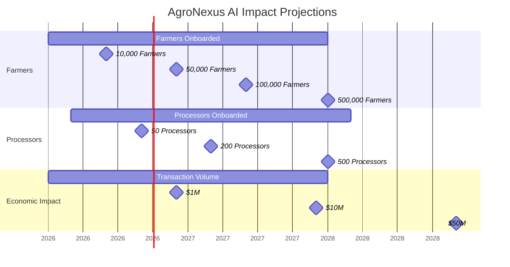
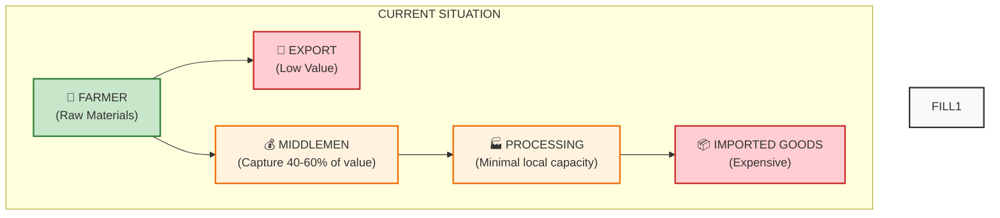
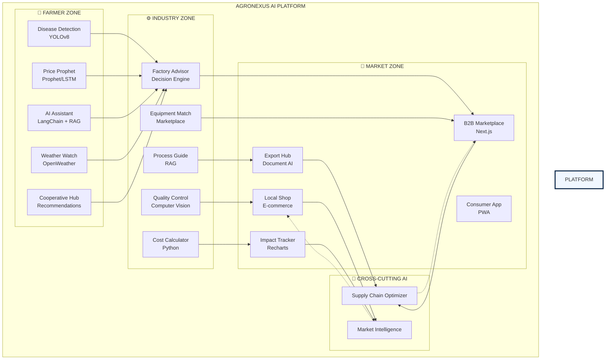
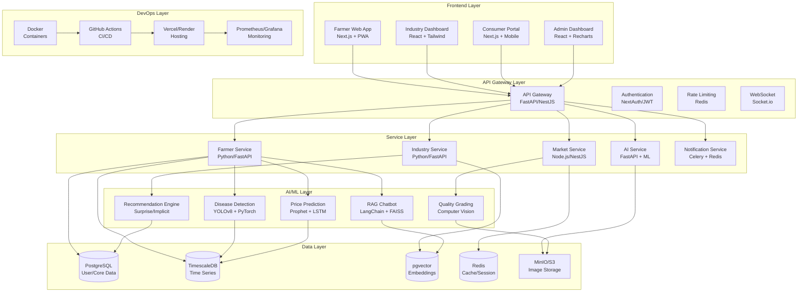

# 🌱 AgroNexus AI

[](https://www.python.org/)
[](https://fastapi.tiangolo.com)
[](https://nextjs.org/)
[](https://www.postgresql.org/)
[](https://www.docker.com/)
[](https://ultralytics.com)
[](https://python.langchain.com)
[](https://opensource.org/licenses/MIT)
[](https://github.com/TsegayIS122123/agronexus-ai/actions/workflows/ci.yml)
[](https://codecov.io/gh/TsegayIS122123/agronexus-ai)
[](https://twitter.com/AgroNexusAI)

<!-- <p align="center">
  
</p> -->

<h3 align="center">
  Connecting Ethiopian Agriculture to Industry Through Artificial Intelligence
</h3>

## 🎯 Overview

**AgroNexus AI** is an end-to-end artificial intelligence platform designed to bridge the critical gap between Ethiopian smallholder farmers and the agro-industrial sector. The platform leverages cutting-edge AI technologies to create a seamless value chain from farm to factory to market.

### Why AgroNexus AI?

Ethiopia's agriculture sector employs over 60% of the population but contributes only 35% to GDP—a massive value leak occurs between production and processing. Farmers face three fundamental challenges:

| Challenge | Impact | Solution |
|-----------|--------|----------|
| **Information Asymmetry** | Farmers lack access to market prices, weather forecasts, and expert advice | AI-powered assistant with real-time data in local languages |
| **Disease & Pest Outbreaks** | 30-50% annual crop loss without early detection | Computer vision models trained on Ethiopian crop diseases |
| **Value Chain Fragmentation** | 40-60% of profits captured by middlemen | Direct B2B marketplace connecting farmers to processors |

### Vision

> *"To transform Ethiopia from a raw material exporter to a manufacturing hub by democratizing access to agricultural intelligence and industrial connections."*

### Mission

1. **Empower 1 million farmers** with AI tools by 2030
2. **Enable 1,000+ local agro-processors** to manufacture finished goods
3. **Reduce food imports by $500M** through import substitution
4. **Create 50,000+ jobs** across the agricultural value chain

### Target Users

| User Group | Pain Point | AgroNexus Solution |
|------------|------------|-------------------|
| **Smallholder Farmers** | No access to expert advice, price information | Mobile app with AI assistant, disease detection, price forecasts |
| **Farmer Cooperatives** | Fragmented selling power | Cooperative formation tools, bulk selling platform |
| **Agro-Processors** | Inconsistent raw material supply, quality issues | Factory advisor, quality control AI, B2B marketplace |
| **Equipment Suppliers** | Limited market reach | Equipment listing and matching platform |
| **Government Agencies** | No agricultural data for policy making | Impact tracker dashboard, regional analytics |
| **NGOs & Development Partners** | Difficulty measuring intervention impact | Impact metrics API, customizable reports |

### Key Differentiators

| Feature | Traditional Solutions | AgroNexus AI |
|---------|----------------------|--------------|
| **Language Support** | English only | Amharic, Oromo, Tigrinya, English |
| **AI Models** | Generic, not locally trained | Fine-tuned on Ethiopian crops and conditions |
| **Connectivity** | Requires constant internet | Offline-first PWA + SMS integration |
| **Value Chain** | Single point solution | End-to-end (farm → factory → market) |
| **Data Ownership** | Farmers lose data rights | Farmer-owned data with blockchain provenance |
| **Cost** | Expensive subscription | Freemium model with government subsidies |

### Success Metrics (2026-2028)


---

## 📊 **THE PROBLEM**



Ethiopia faces a critical **agricultural value chain gap**:

| Challenge | Impact |
|-----------|--------|
| **Crop Diseases** | 30-50% yield loss annually |
| **Price Volatility** | Farmers sell at 40-60% below market value |
| **Middlemen Exploitation** | Capture majority of profits |
| **Minimal Local Processing** | $2B+ spent on food imports |
| **Post-Harvest Loss** | 20-30% of crops wasted |

---

## 🚀 **THE SOLUTION: AGRONEXUS AI**



---

## ✨ **KEY FEATURES**

### 🌾 **Farmer Zone**
| Feature | Technology | Impact |
|---------|------------|--------|
| **Crop Disease Detection** | YOLOv8 + PyTorch | 85% accuracy, instant diagnosis |
| **Price Prophet** | Prophet + LSTM | 30-day price forecasts, MAPE < 15% |
| **AI Assistant** | LangChain + RAG + Gemini | 24/7 advice in Amharic/Oromo |
| **Weather Watch** | OpenWeather API | Hyperlocal 5-day forecasts |
| **Cooperative Hub** | Recommendation Engine | Connect farmers automatically |

### ⚙️ **Industry Zone**
| Feature | Technology | Impact |
|---------|------------|--------|
| **Factory Advisor** | Decision Engine | ROI analysis for 20+ products |
| **Equipment Match** | Marketplace | Connect buyers/sellers |
| **Quality Control AI** | Computer Vision | Export-standard grading |
| **Process Guide** | RAG + Video | Step-by-step in local languages |
| **Cost Calculator** | Python + Pandas | Manufacturing cost analysis |

### 🤝 **Market Zone**
| Feature | Technology | Impact |
|---------|------------|--------|
| **B2B Marketplace** | Next.js + PostgreSQL | Direct farmer-processor connection |
| **Local Shop** | E-commerce Platform | Buy Ethiopian products |
| **Export Hub** | Document AI | Auto-fill export forms |
| **Impact Tracker** | Recharts + D3.js | Real-time economic impact |
| **Consumer App** | PWA + Offline-first | Works without internet |

---

## 🏗️ **SYSTEM ARCHITECTURE**



---

## 📦 **TECHNOLOGY STACK**

| Layer | Technology | Purpose |
|-------|------------|---------|
| **Frontend** | Next.js 15, TypeScript, Tailwind CSS | React framework with SSR |
| **Backend** | FastAPI (Python), NestJS (Node) | High-performance APIs |
| **Database** | PostgreSQL, TimescaleDB, pgvector | Primary + time-series + vectors |
| **AI/ML** | YOLOv8, LangChain, Prophet, PyTorch | Computer vision, NLP, forecasting |
| **DevOps** | Docker, GitHub Actions, Vercel | Containerization, CI/CD, hosting |


---

## 📁 **PROJECT STRUCTURE**

```
agronexus-ai/
├── apps/
│   ├── web/                      # Next.js frontend
│   │   ├── app/                   # App router
│   │   ├── components/             # Reusable components
│   │   ├── lib/                    # Utilities, hooks
│   │   └── public/                 # Static assets
│   │
│   ├── api/                       # FastAPI backend
│   │   ├── routes/                 # API endpoints
│   │   ├── models/                 # Database models
│   │   ├── schemas/                # Pydantic schemas
│   │   ├── services/               # Business logic
│   │   └── utils/                  # Helpers
│   │
│   └── mobile/                     # React Native (future)
│
├── packages/
│   ├── database/                   # Shared DB schemas
│   ├── ai-models/                  # ML model code
│   │   ├── disease-detection/       # YOLOv8
│   │   ├── chatbot/                 # LangChain
│   │   └── price-prediction/        # Prophet/LSTM
│   └── shared/                      # Shared utilities
│
├── infrastructure/
│   ├── docker/                      # Dockerfiles
│   ├── kubernetes/                   # K8s configs (future)
│   └── terraform/                    # IaC (future)
│
├── scripts/
│   ├── data-collection/              # Scraping scripts
│   ├── model-training/                # Training pipelines
│   └── deployment/                    # Deploy scripts
│
├── tests/
│   ├── unit/                         # Unit tests
│   ├── integration/                   # Integration tests
│   └── e2e/                           # End-to-end tests
│
├── docs/                             # Documentation
│   └── images/                        # Diagrams, screenshots
│
├── .github/
│   └── workflows/
│       ├── ci.yml                    # CI pipeline
│       └── deploy.yml                 # CD pipeline
│
├── data/                             # Local data (gitignored)
│   ├── raw/
│   ├── processed/
│   └── models/
│
├── docker-compose.yml
├── .env.example
├── .gitignore
├── pyproject.toml                    # Python project config
├── package.json                       # Node project config
└── README.md
```

## 🚀 **QUICK START**

### Prerequisites
- Python 3.11+
- Node.js 18+
- Docker & Docker Compose
- Git

### 1. Clone Repository
```bash
git clone https://github.com/TsegayIS122123/agronexus-ai.git
cd agronexus-ai
```

### 2. Backend Setup (FastAPI)
```bash
cd apps/api

# Create virtual environment with uv (fast alternative to pip)
pip install uv
uv venv
source .venv/bin/activate  # On Windows: .venv\Scripts\activate

# Install dependencies
uv pip install -r requirements.txt

# Run development server
uvicorn app.main:app --reload --port 8000
```

### 3. Frontend Setup (Next.js)
```bash
cd apps/web

# Install dependencies
npm install

# Run development server
npm run dev
```

### 4. Docker Setup (Full Stack)
```bash
# From root directory
docker-compose up -d

# View logs
docker-compose logs -f
```

### 5. Environment Variables
```bash
# Copy example env file
cp .env.example .env

# Edit with your values
# - Database URLs
# - API Keys (OpenWeather, Gemini)
# - JWT Secrets
```
---
### Testing Strategy

| Test Type | Tool | Coverage Target | When to Run |
|-----------|------|-----------------|-------------|
| **Unit Tests** | pytest, Jest | 85%+ | Every commit |
| **Integration Tests** | pytest, Supertest | 70%+ | Every PR |
| **E2E Tests** | Playwright, Cypress | Critical paths | Before release |
| **Model Tests** | Custom scripts | 85% accuracy | Weekly |
| **Performance Tests** | Locust, k6 | <200ms response | Monthly |
| **Security Tests** | Bandit, OWASP ZAP | No critical issues | Monthly |

##  **VERIFICATION**

```bash
# Check repository on GitHub
# Open: https://github.com/TsegayIS122123/agronexus-ai

# Test locally
docker-compose up -d
# Open http://localhost:3000 for frontend
# Open http://localhost:8000/docs for API docs
```
## 🤝 Contributing

I warmly welcome contributions from the community! Whether you're fixing a bug, adding a feature, improving documentation, or translating to another Ethiopian language, your help makes AgroNexus AI better for everyone.

### 🌟 Ways to Contribute

| Contribution Type | Examples | Skill Level |
|-------------------|----------|-------------|
| **Code** | Bug fixes, new features, performance improvements | Intermediate/Advanced |
| **Documentation** | README updates, API docs, tutorials | Beginner/Intermediate |
| **Translation** | Amharic, Oromo, Tigrinya translations | Any level |
| **Testing** | Writing tests, reporting bugs | Beginner |
| **Data Collection** | Crop disease images, price data | Any level |
| **Feedback** | Feature requests, usability testing | Any level |


## 👤 **AUTHOR**

### Tsegay Assefa 

**AI/ML Engineer & Full-Stack Developer**

### Connect with Me

| Platform | Link |
|----------|------|
| **GitHub** | [@TsegayIS122123](https://github.com/TsegayIS122123) |
| **LinkedIn** | [tsegay-assefa-95a397336](https://linkedin.com/in/tsegay-assefa-95a397336) |
| **Email** | tsegayassefa27@gmail.com |
| **Twitter/X** | [@AgroNexusAI](https://twitter.com/AgroNexusAI) |
| **Portfolio** | [tsegayassefa.github.io](https://tsegayassefa.github.io) |

### My Journey

- 🎓 **3rd Year Information Science** at Addis Ababa University
- 🤖 **AI/ML Trainee** at 10 Academy (Kifiya KAIM Program)
- 🔒 **Cybersecurity Trainee** at INSA 
- 💻 **Full-Stack Developer** with 11 production projects
---

## 🙏 **ACKNOWLEDGMENTS**

### Educational Institutions

| Institution | Support |
|-------------|---------|
| **Addis Ababa University** | Academic foundation, research resources |
| **10 Academy** | Advanced AI/ML training, project mentorship |
| **Kallamino Special High School** | Early education foundation|
| **INSA Cyber Talent Program** | Cybersecurity training, infrastructure knowledge |

### Tools & Technologies

Special thanks to the open-source communities behind:

| Technology | Why We're Grateful |
|------------|-------------------|
| **YOLOv8 (Ultralytics)** | State-of-the-art computer vision made accessible |
| **LangChain** | RAG chatbot framework that powers our AI assistant |
| **FastAPI** | High-performance API framework |
| **Next.js** | React framework for our frontend |
| **PostgreSQL** | Reliable, feature-rich database |
| **Docker** | Containerization that makes deployment reproducible |
| **PyMC** | Bayesian modeling inspiration |
| **Prophet** | Time series forecasting |

### Data Sources

- **Ethiopian Ministry of Agriculture** - Crop statistics
- **Ethiopian Meteorological Institute** - Weather data
- **OpenWeather API** - Real-time weather forecasts
- **Chapa API** - Ethiopian payment gateway

### Special Thanks

> *To every Ethiopian farmer who wakes before dawn to feed our nation - this is for you.*

---
## ⭐ **SUPPORT**

If you find this project helpful, please give it a ⭐ on GitHub!

<!-- <p align="center">
  
</p> -->

<p align="center">
  <b>From Soil to Shelf, Powered by AI</b><br>
  <i>Building Ethiopia's Agro-Industrial Future</i>
</p>

<p align="center">
© 2026 AgroNexus AI. All rights reserved. This demo showcases proprietary technology.
Unauthorized reproduction or distribution of this software is prohibited.
<br>Made with ❤️ in Addis Ababa, Ethiopia
</p>
