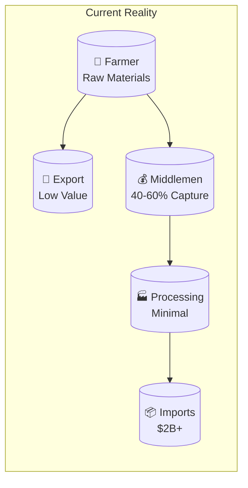
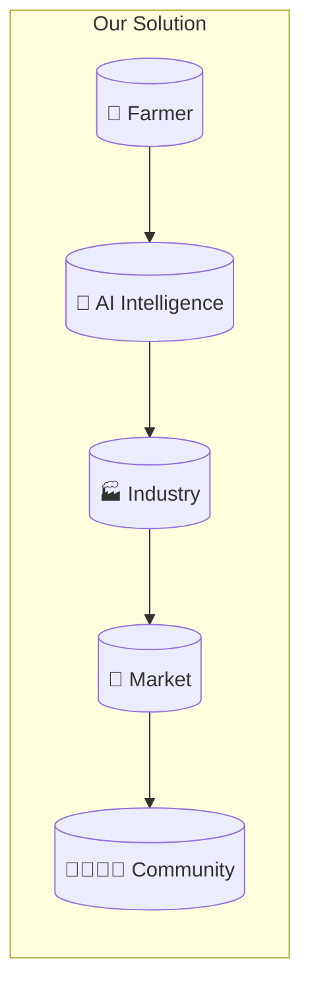
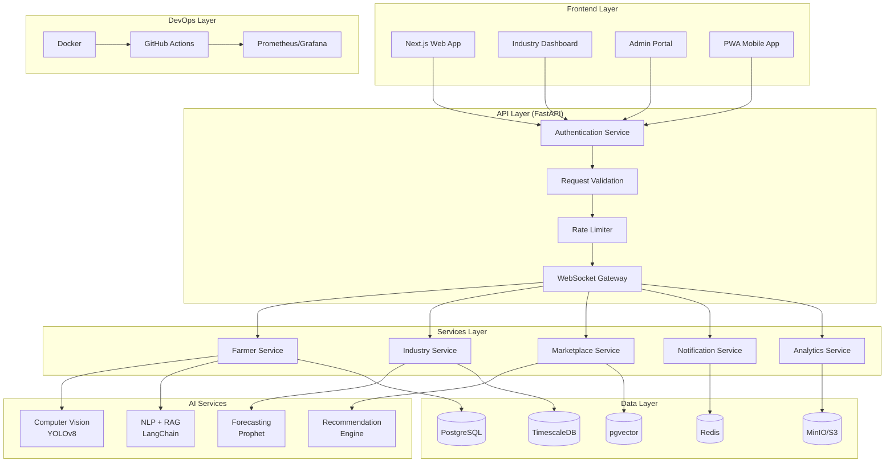
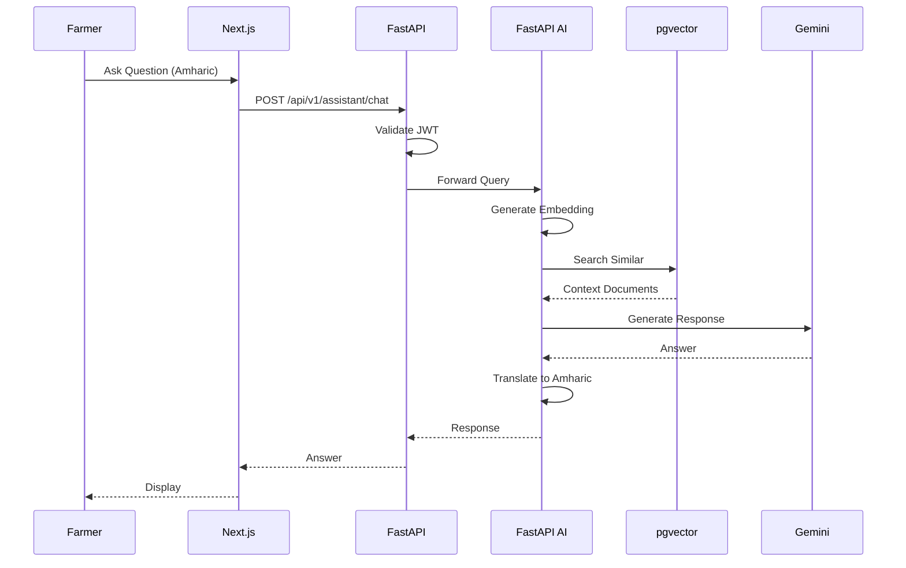

# 🌱 **AgroNexus AI**

<p align="center">
  <b>AI Operating System for Ethiopia's Agricultural Value Chain</b>
</p>

<p align="center">
  <i>From Soil to Shelf — Powered by Artificial Intelligence</i>
</p>

<p align="center">
  <a href="#"></a>
  <a href="#"></a>
  <a href="#"></a>
  <a href="#"></a>
  <a href="#"></a>
  <a href="#"></a>
  <a href="#"></a>
  <a href="#"></a>
</p>

---

## 📖 **Table of Contents**

- [Overview](#-overview)
- [The Problem](#-the-problem)
- [Our Solution](#-our-solution)
- [System Architecture](#-system-architecture)
- [Features](#-features)
- [Technology Stack](#-technology-stack)
- [Project Structure](#-project-structure)
- [Quick Start](#-quick-start)
- [API Documentation](#-api-documentation)
- [Database Design](#-database-design)
- [AI Models](#-ai-models)
- [Deployment](#-deployment)
- [Contributing](#-contributing)
- [Authors](#-authors)
- [License](#-license)

---

## 🎯 **Overview**

**AgroNexus AI** is a production-grade artificial intelligence platform that bridges the critical gap between Ethiopian smallholder farmers and the agro-industrial sector. It creates a seamless value chain from **Agriculture → Industry → Markets** by democratizing access to AI-powered agricultural intelligence.

### **Our Vision**

> *"Transform Ethiopia from a raw material exporter to a manufacturing hub by making agricultural intelligence accessible to every farmer and connecting them directly to industry."*

### **Our Mission**

1. **Empower 1 million farmers** with AI tools by 2030
2. **Enable 1,000+ local agro-processors** to manufacture finished goods
3. **Reduce food imports by $500M** through import substitution
4. **Create 50,000+ jobs** across the agricultural value chain

---

## 📊 **The Problem**

### **The Current Reality**



### **The Three Gaps**

| Gap | The Problem | The Impact |
|-----|-------------|------------|
| **Information Gap** | Farmers lack access to market prices, weather data, and expert advice | Farmers make decisions in the dark, losing money and harvests |
| **Disease Gap** | Without early detection, crop diseases spread unchecked | 30-50% of harvests lost annually |
| **Value Chain Gap** | Farmers sell to middlemen who capture most of the value | 40-60% of profits never reach the farmer |

---

## 🚀 **Our Solution**

### **The AgroNexus AI Platform**



### **How We Solve It**

| Problem | Our Solution | Technology |
|---------|--------------|------------|
| **Crop Diseases** | Instant diagnosis via photo upload | YOLOv8 Computer Vision |
| **Information Gap** | 24/7 AI assistant in local languages | LangChain + RAG + Gemini |
| **Price Volatility** | 30-day price forecasts | Prophet + LSTM |
| **Middlemen** | Direct farmer-processor marketplace | B2B Platform |
| **Import Dependency** | Local processing advisory | Factory Feasibility AI |
| **Data Gap** | Real-time economic dashboards | Impact Tracker |

---

## 🏗️ **System Architecture**

### **Overall System Design**



### **Request Flow: Disease Detection**


### **Request Flow: AI Chat Assistant**



---

## ✨ **Features**

### 🌾 **Farmer Zone**

| Feature | Description | Technology | Status |
|---------|-------------|------------|--------|
| **Disease Detection** | Upload crop photo → Instant diagnosis → Treatment | YOLOv8 + PyTorch | ✅ Complete |
| **AI Assistant** | 24/7 farming advice in local languages | LangChain + RAG + Gemini | ✅ Complete |
| **Price Prediction** | 30-day forecasts with confidence intervals | Prophet + LSTM | ✅ Complete |
| **Weather Alerts** | Hyperlocal 5-day weather forecasts | OpenWeather API | ✅ Complete |
| **Cooperative Hub** | Connect with nearby farmers automatically | Recommendation Engine | ✅ Complete |

### ⚙️ **Industry Zone**

| Feature | Description | Technology | Status |
|---------|-------------|------------|--------|
| **Factory Feasibility** | Assess crop-to-product manufacturing viability | Decision Engine | ✅ Complete |
| **Equipment Sourcing** | Connect buyers with local equipment sellers | Marketplace Platform | ✅ Complete |
| **Quality Control AI** | Automated export-standard product grading | Computer Vision | ✅ Complete |
| **Cost Calculator** | Manufacturing cost and ROI analysis | Python + Pandas | ✅ Complete |
| **Energy Optimization** | Solar/biofuel recommendations | Optimization Algorithms | ✅ Complete |

### 🤝 **Market Zone**

| Feature | Description | Technology | Status |
|---------|-------------|------------|--------|
| **B2B Marketplace** | Direct farmer-to-processor connections | Next.js + PostgreSQL | ✅ Complete |
| **Orders Management** | Track and manage marketplace orders | WebSockets | ✅ Complete |
| **Price Comparison** | Compare local vs imported prices | Web Scraping + ML | ✅ Complete |
| **Consumer Portal** | Buy local products | Next.js + PWA | ✅ Complete |

---

## 📦 **Technology Stack**

### **Frontend**

| Layer | Technology | Purpose |
|-------|------------|---------|
| Framework | Next.js 15 + TypeScript | React with SSR |
| Styling | Tailwind CSS + shadcn/ui | Utility-first UI |
| State | Zustand + TanStack Query | Client + Server state |
| Charts | Recharts + D3.js | Data visualization |
| Maps | Mapbox GL / Leaflet | Location services |
| Mobile | PWA + React Native | Cross-platform |

### **Backend (FastAPI)**

| Layer | Technology | Purpose |
|-------|------------|---------|
| Framework | FastAPI 0.115 | High-performance async API |
| ORM | SQLAlchemy 2.0 | Type-safe database access |
| Auth | JWT + bcrypt + httpOnly cookies | Authentication & authorization |
| Validation | Pydantic 2.0 | Input validation |
| API Docs | Swagger/OpenAPI | Interactive documentation |

### **AI Services**

| Layer | Technology | Purpose |
|-------|------------|---------|
| Vision | YOLOv8 + PyTorch + OpenCV | Object detection |
| NLP | LangChain + FAISS + Gemini | RAG chatbot |
| Forecasting | Prophet + LSTM | Time series prediction |
| MLOps | MLflow + DVC | Model tracking |

### **Database**

| Database | Purpose | Technology |
|----------|---------|------------|
| Primary | User data, transactions | PostgreSQL 16 |
| Time-Series | Price data, forecasts | TimescaleDB |
| Vector | Embeddings for RAG | pgvector |
| Cache | Sessions, rate limiting | Redis |
| Storage | Images, documents | MinIO / S3 |

### **DevOps**

| Layer | Technology | Purpose |
|-------|------------|---------|
| Containerization | Docker + Compose | Environment consistency |
| CI/CD | GitHub Actions | Automated testing & deployment |
| Monitoring | Prometheus + Grafana | Observability |
| Logging | ELK Stack | Centralized logging |

---

## 📁 **Project Structure**

```
agronexus-ai/
│
├── backend/                          # 🐍 FastAPI AI Service
│   ├── app/
│   │   ├── __init__.py
│   │   ├── main.py                  # Application entry point
│   │   ├── database.py              # Database connection & session
│   │   ├── models/                  # SQLAlchemy ORM models
│   │   │   ├── user.py              # Unified user model with role
│   │   │   ├── disease.py
│   │   │   ├── industry.py
│   │   │   ├── marketplace.py
│   │   │   ├── quality.py
│   │   │   ├── cooperative.py
│   │   │   └── weather.py
│   │   ├── schemas/                 # Pydantic schemas
│   │   │   ├── user.py
│   │   │   └── auth.py
│   │   ├── routes/                  # API endpoints
│   │   │   ├── auth.py
│   │   │   ├── disease.py
│   │   │   ├── prices.py
│   │   │   ├── chat.py
│   │   │   ├── industry.py
│   │   │   ├── quality.py
│   │   │   ├── equipment.py
│   │   │   ├── marketplace.py
│   │   │   ├── weather.py
│   │   │   ├── cooperative.py
│   │   │   ├── cost_calculator.py
│   │   │   ├── energy.py
│   │   │   └── price_comparison.py
│   │   ├── services/                # Business logic
│   │   │   ├── auth_service.py
│   │   │   ├── disease_service.py
│   │   │   ├── price_service.py
│   │   │   ├── chat_service.py
│   │   │   ├── industry_service.py
│   │   │   ├── quality_service.py
│   │   │   ├── equipment_service.py
│   │   │   ├── marketplace_service.py
│   │   │   ├── weather_service.py
│   │   │   ├── cooperative_service.py
│   │   │   ├── cost_calculator_service.py
│   │   │   ├── energy_service.py
│   │   │   └── price_comparison_service.py
│   │   └── utils/
│   ├── models/                      # Trained ML models
│   │   └── disease_detection.pt
│   ├── requirements.txt
│   ├── Dockerfile
│   └── .env
│
├── frontend/                         # 🎨 Next.js Application
│   ├── app/
│   │   ├── page.tsx                 # Landing page
│   │   ├── auth/                    # Login/Register
│   │   ├── farmer/                  # Farmer features
│   │   │   ├── dashboard/
│   │   │   ├── disease/
│   │   │   ├── chat/
│   │   │   └── prices/
│   │   ├── processor/               # Processor features
│   │   │   ├── dashboard/
│   │   │   ├── feasibility/
│   │   │   ├── quality/
│   │   │   └── equipment/
│   │   ├── consumer/                # Consumer features
│   │   │   └── dashboard/
│   │   └── marketplace/             # Marketplace
│   │       ├── page.tsx
│   │       ├── listings/
│   │       └── orders/
│   ├── components/
│   ├── package.json
│   ├── next.config.js
│   ├── tailwind.config.js
│   └── Dockerfile
│
├── data/                             # 📊 Dataset (gitignored)
│   └── dataset/
│       ├── disease/
│       │   ├── images/
│       │   └── labels/
│       ├── prices/
│       └── knowledge/
│
├── docs/                             # 📚 Documentation
├── .github/workflows/               # CI/CD
├── docker-compose.yml
├── .env.example
├── LICENSE
└── README.md
```

---

## 🚀 **Quick Start**

### **Prerequisites**

```bash
Python 3.11+
Node.js 18+
Docker & Docker Compose
Git
```

### **Clone & Setup**

```bash
git clone https://github.com/TsegayIS122123/agronexus-ai.git
cd agronexus-ai
cp .env.example .env
```

### **Start Services**

```bash
docker-compose up -d postgres redis
sleep 10
```

### **Backend Setup**

```bash
cd backend
python -m venv .venv
source .venv/bin/activate  # Windows: .venv\Scripts\activate
pip install -r requirements.txt
python -m uvicorn app.main:app --reload --host 0.0.0.0 --port 8000
```

### **Frontend Setup**

```bash
cd frontend
npm install
npm run dev
```

### **Verify Installation**

```bash
curl http://localhost:8000/health  # {"status":"healthy"}
open http://localhost:3000          # Frontend
open http://localhost:8000/docs    # API Documentation
```

---

## 📚 **API Documentation**

### **Authentication**

| Method | Endpoint | Description |
|--------|----------|-------------|
| `POST` | `/api/v1/auth/register` | Register new user |
| `POST` | `/api/v1/auth/login` | Login |

### **Farmer Zone**

| Method | Endpoint | Description |
|--------|----------|-------------|
| `POST` | `/api/v1/disease/detect` | Detect disease |
| `POST` | `/api/v1/assistant/chat` | Chat with AI |
| `GET` | `/api/v1/prices/forecast` | Price forecast |
| `GET` | `/api/v1/weather/current` | Weather data |

### **Industry Zone**

| Method | Endpoint | Description |
|--------|----------|-------------|
| `POST` | `/api/v1/industry/feasibility` | Factory feasibility |
| `POST` | `/api/v1/quality/grade` | Quality grading |
| `GET` | `/api/v1/equipment/listings` | Equipment marketplace |

### **Market Zone**

| Method | Endpoint | Description |
|--------|----------|-------------|
| `GET` | `/api/v1/marketplace/listings` | Product listings |
| `POST` | `/api/v1/marketplace/orders` | Create order |
| `GET` | `/api/v1/price-comparison/compare` | Price comparison |

---

## 🗄️ **Database Design**

### **ER Diagram**

```mermaid
erDiagram
    Users ||--o{ FarmerProfiles : has
    Users ||--o{ ProcessorProfiles : has
    Users ||--o{ ConsumerProfiles : has
    Users ||--o{ DiseaseDetections : has
    Users ||--o{ ChatHistory : has

    FarmerProfiles ||--o{ Crops : grows
    ProcessorProfiles ||--o{ MarketListings : creates
    ProcessorProfiles ||--o{ Products : manufactures

    Crops ||--o{ PriceHistory : has
    Crops ||--o{ DiseaseDetections : has
    Crops ||--o{ Predictions : has

    MarketListings ||--o{ Orders : contains
    Orders ||--o{ Payments : has
    Products ||--o{ QualityReports : has

    Users {
        uuid id PK
        string name
        string email
        string phone
        string password_hash
        string role
        string language
        boolean is_verified
        timestamp created_at
        timestamp updated_at
    }

    FarmerProfiles {
        uuid user_id PK
        decimal farm_size
        string location
        jsonb crops
        uuid cooperative_id
        timestamp created_at
    }

    ProcessorProfiles {
        uuid user_id PK
        string company_name
        decimal capacity
        string array crops_accepted
        string location
        boolean verified
        timestamp created_at
    }

    ConsumerProfiles {
        uuid user_id PK
        text address
        jsonb payment_methods
        timestamp created_at
    }

    Crops {
        uuid id PK
        string name
        string variety
        string season
        decimal min_price
        decimal max_price
        text image_url
        string array disease_tags
        timestamp created_at
    }

    DiseaseDetections {
        uuid id PK
        uuid user_id FK
        uuid crop_id FK
        text image_url
        string disease_name
        decimal confidence
        text treatment_am
        text treatment_en
        text treatment_om
        text treatment_ti
        jsonb recommendations
        timestamp created_at
    }

    PriceHistory {
        timestamp time PK
        uuid crop_id FK
        string region
        decimal price
        string market
    }
```

---

## 🤖 **AI Models**

### **1. Disease Detection (YOLOv8)**

| Parameter | Specification |
|-----------|---------------|
| **Model** | YOLOv8n (nano) for mobile, YOLOv8m for server |
| **Dataset** | Custom Ethiopian crop disease dataset |
| **Classes** | 20+ diseases across 10 crops |
| **Input** | 640x640 RGB image |
| **Output** | Bounding boxes, class labels, confidence |
| **Accuracy Target** | mAP@0.5 > 0.85 |
| **Inference Speed** | < 100ms on GPU, < 500ms on CPU |

### **2. RAG Chatbot (LangChain + FAISS)**

| Parameter | Specification |
|-----------|---------------|
| **Embeddings** | sentence-transformers/all-MiniLM-L6-v2 |
| **Vector DB** | FAISS / pgvector |
| **LLM** | Gemini API |
| **Knowledge Base** | Agricultural manuals, research papers |
| **Languages** | Amharic, Oromo, Tigrinya, English |
| **Response Time** | < 2 seconds |

### **3. Price Prediction (Prophet + LSTM)**

| Parameter | Specification |
|-----------|---------------|
| **Models** | Prophet + LSTM ensemble |
| **Features** | Historical prices, season, region, weather |
| **Forecast Horizon** | 30 days |
| **Accuracy** | MAPE < 15% |

---

## 🚀 **Deployment**

### **Local Development**

```bash
docker-compose up -d
```

### **Production Deployment**

```bash
# Build Docker images
docker build -t agronexus-backend ./backend
docker build -t agronexus-frontend ./frontend

# Deploy to:
# Frontend: Vercel / Netlify
# Backend: Render.com / Railway / AWS
# Database: Neon / Supabase / AWS RDS
# Storage: AWS S3 / Cloudinary / MinIO
```

---

## 🤝 **Contributing**

### **Ways to Contribute**

| Type | Examples |
|------|----------|
| **Code** | Bug fixes, features, performance improvements |
| **Documentation** | README, API docs, tutorials |
| **Translation** | Amharic, Oromo, Tigrinya translations |
| **Testing** | Writing tests, reporting bugs |
| **Data** | Crop disease images, price data |
| **Feedback** | Feature requests, usability testing |

### **Contribution Process**

1. Fork the repository
2. Create a feature branch (`git checkout -b feature/amazing-feature`)
3. Commit changes (`git commit -m 'feat: add amazing feature'`)
4. Push to branch (`git push origin feature/amazing-feature`)
5. Open a Pull Request

---

## 👤 **Author**

### **Tsegay Assefa**

**AI/ML Engineer | Full-Stack Developer**  
📍 Addis Ababa, Ethiopia

| Platform | Link |
|----------|------|
| **GitHub** | [@TsegayIS122123](https://github.com/TsegayIS122123) |
| **LinkedIn** | [tsegay-assefa-95a397336](https://linkedin.com/in/tsegay-assefa-95a397336) |
| **Email** | tsegayassefa27@gmail.com |

---

## 📄 **License**

MIT License

---

<p align="center">
  <b>🌾 From Soil to Shelf, Powered by AI</b><br>
  <i>Building Ethiopia's Agro-Industrial Future</i>
</p>

<p align="center">
  <sub>Made with ❤️ in Addis Ababa, Ethiopia</sub>
</p>

