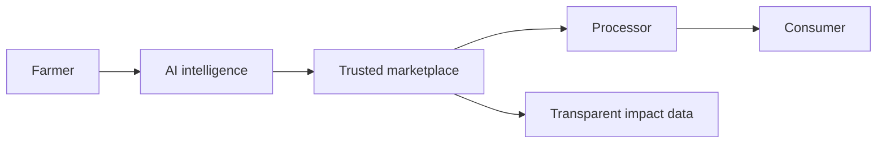
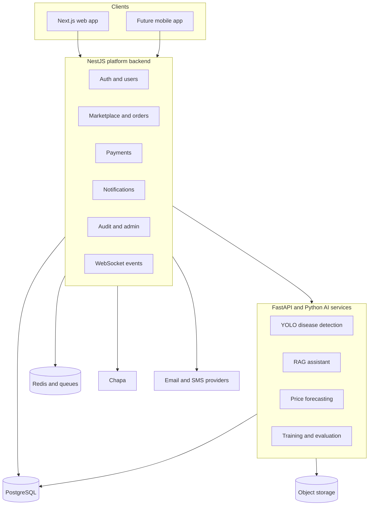

# AgroNexus AI

> **AI for the agricultural value chain in Ethiopia**
>
> Disease intelligence for farmers. Better market decisions. A transparent path from farm to processor.

AgroNexus AI is an AI-native platform concept and working prototype for connecting farmers, processors, and consumers across Ethiopia's agricultural value chain. It combines computer vision, retrieval-augmented generation, forecasting, and secure marketplace workflows in one product direction.

The project is being shaped as a portfolio-grade system with a clear separation of responsibilities:

- **Next.js** for the web experience
- **NestJS** for enterprise business workflows
- **FastAPI/Python** for AI and ML services
- **PostgreSQL, Redis, object storage, and asynchronous workers** for reliable infrastructure

> **Honest status:** the repository contains a functional FastAPI prototype, a Next.js frontend with real feature pages, and — since Phase 2 — a NestJS identity service that is the working system of record for registration, verification, password reset, OTP, and session rotation. It is a validated baseline, not a finished application. The frontend has no shared layout system, the auth UI still bypasses the centralized API layer, raw axios call sites are still scattered across feature pages, the AI paths still degrade to fabricated/keyword behavior in the normal case, and money/quantity columns are `Float` instead of the types the design document specifies. Every one of those gaps is tracked explicitly in [docs/IMPLEMENTATION-ROADMAP.md](docs/IMPLEMENTATION-ROADMAP.md), and the roadmap rule is that a phase is only marked done when its verification commands have actually been run and their output captured.

## Why AgroNexus AI?

Smallholder farmers and agro-processors often lack timely information about crop disease, market prices, quality, and reliable buyers. AgroNexus AI focuses on making those decisions more accessible while preserving a secure, auditable path for real transactions.

## Product vision


```mermaid
flowchart LR
    Farmer[Farmer] --> Intelligence[AI intelligence]
    Intelligence --> Marketplace[Trusted marketplace]
    Marketplace --> Processor[Processor]
    Processor --> Consumer[Consumer]
    Marketplace --> Impact[Transparent impact data]
```

The first target product slice is intentionally narrow:

1. A verified farmer submits a crop image and receives a versioned disease-analysis result.
2. The farmer publishes a product listing.
3. A processor or consumer creates an order.
4. The order is paid through Chapa sandbox verification.
5. Notifications and audit events make the workflow traceable.

That target slice is the implementation goal. The repository currently contains prototype pieces of it, not a tested end-to-end production workflow.

## Capabilities

| Capability | Status | Evidence / next boundary |
|---|---|---|
| Next.js role-based frontend | In Progress | Pages, a shared layout, and role-aware dashboards exist; auth flows go through the session layer rather than `axios`; the remaining dashboard sub-pages still carry hardcoded English and no sidebar yet |
| FastAPI agricultural routes | Implemented (prototype) | 51 endpoints across 13 routers; pytest suite covers config and auth hardening, not every route |
| YOLO disease detection | In Progress | Real inference path against `data/models/disease-detection/v1/`; fallback still fabricates results and is flagged `fallback_mode: true`; no measured evaluation yet |
| RAG agricultural assistant | In Progress | Gemini call plus a hardcoded keyword knowledge base; no vector retrieval or populated document store |
| Price and market features | In Progress | Prophet/database route exists; no LSTM execution or evaluation tests |
| Marketplace listings and orders | Implemented (prototype) | CRUD/status routes exist with ownership checks; payments not integrated; money columns are `Float` |
| Authentication and authorization | Implemented (prototype, backend) | Admin role rejected at registration, order updates authorized on buyer/seller ID, startup-validated secret. Covered by tests: 30 e2e against real Postgres plus 35 unit. |
| Localization | Implemented | English and Amharic, switched from a language toggle in the header. Every string lives in the translation tables and a parity test fails the build when a locale is missing a key, so a half-translated language cannot ship. Adding a language is a table entry, not a page rewrite. |
| Configuration management | Implemented | `ai-service/app/core/config.py` is the single validated env surface; unknown values fail at startup |
| Frontend layout foundations | Implemented | Shared header and footer with design tokens, one header per page (dashboards render their own), an accessible button system, and 51 frontend tests |
| Frontend API migration | Not started | Feature `api.ts` modules exist but are not imported; pages call `axios` directly |
| Chapa payments | Planned | No provider adapter, sandbox checkout, webhook, or payment endpoint |
| Email/SMS notifications | Planned | No email/SMS provider integration or notification worker |
| Email verification / password reset / SMS OTP | Implemented | Endpoints exist for email verification, password reset, and SMS/email OTP, all covered by the e2e suite. Tokens are stored only as hashes and are single-use. Delivery is logged in development rather than sent through a provider. |
| Mobile application | Planned | No mobile client or mobile-specific backend implementation |

### Security issues previously listed here

The two issues this section used to call out are **fixed and covered by tests**
in `tests/test_phase1_hardening.py`:

- ~~Public admin registration~~ — `UserRegister.role` now only accepts
  `farmer`, `processor`, or `consumer`; admin accounts must be provisioned
  server-side.
- ~~Order authorization by role name~~ — `update_order_status` compares the
  authenticated user against the order's actual `buyer_id` / `seller_id`.

New in the current work: `SECRET_KEY` is validated at startup (minimum 32
characters, no fallback), `ALGORITHM` is pinned to HMAC algorithms so a
misconfigured deployment cannot accept unsigned tokens, and the signing key is
read per request so rotating it invalidates existing tokens without a restart.

Still open and not yet fixed: rate limiting, refresh-token rotation, email
verification, and audit logging.


## Architecture


```mermaid
flowchart TB
    subgraph Clients
        WEB[Next.js web app]
        MOBILE[Future mobile app]
    end

    subgraph Platform[NestJS platform backend]
        AUTH[Auth and users]
        MARKET[Marketplace and orders]
        PAY[Payments]
        NOTIFY[Notifications]
        AUDIT[Audit and admin]
        WS[WebSocket events]
    end

    subgraph AI[FastAPI and Python AI services]
        VISION[YOLO disease detection]
        RAG[RAG assistant]
        FORECAST[Price forecasting]
        EVAL[Training and evaluation]
    end

    DB[(PostgreSQL)]
    REDIS[(Redis and queues)]
    STORE[(Object storage)]
    CHAPA[Chapa]
    PROVIDERS[Email and SMS providers]

    WEB --> Platform
    MOBILE --> Platform
    Platform --> DB
    Platform --> REDIS
    Platform --> AI
    Platform --> CHAPA
    Platform --> PROVIDERS
    AI --> DB
    AI --> STORE
```

The browser never calls FastAPI directly. NestJS is the public business boundary; FastAPI is an authenticated internal AI service. Long-running inference, notifications, training, and reconciliation run through queues rather than blocking web requests.

## Documentation

| Document | Purpose |
|---|---|
| [01 - Product Overview](docs/01-product-overview.md) | Product vision, users, zones, boundaries, and success measures |
| [02 - Software Requirements Specification](docs/02-software-requirements-specification.md) | Functional, security, performance, and acceptance requirements |
| [03 - Software Design Specification](docs/03-software-design-specification.md) | Services, modules, APIs, security flows, and integration design |
| [04 - Database Design](docs/04-database-design.md) | Entities, columns, relationships, indexes, and state rules |
| [05 - UI/UX Specification](docs/05-ui-ux-specification.md) | User journeys, accessibility, localization, and frontend security |
| [06 - AI System](docs/06-ai-system.md) | Model lifecycle, RAG, evaluation, MLOps, and AI safety |
| [07 - Testing and Quality Assurance](docs/07-testing-and-quality-assurance.md) | Test pyramid, security tests, quality gates, and release evidence |
| [08 - Deployment and DevOps](docs/08-deployment-and-devops.md) | Environments, containers, CI/CD, secrets, observability, and recovery |
| [09 - Platform Decision Rule](docs/09-platform-decision-rule.md) | Why NestJS and FastAPI coexist and how migration is controlled |

## Repository today

```text
agronexus-ai/
├── ai-service/           # Current FastAPI prototype and AI/business routes
├── backend/              # NestJS scaffold (health check only)
├── frontend/             # Current Next.js application
├── mobile/               # Not started
├── data/                 # Local datasets and model artifacts
├── docs/                 # Product and engineering specifications (01-09)
├── tests/                # pytest suite for the ai-service
├── .github/workflows/    # CI, migration verification, image builds
├── docker-compose.yml    # Local PostgreSQL development services
└── README.md
```

The target migration layout is documented in [03 - Software Design Specification](docs/03-software-design-specification.md). It will be introduced incrementally after API contracts and tests are in place. `docs/IMPLEMENTATION-ROADMAP.md` tracks the current validated baseline and the re-ordered implementation phases.

## Local development: current prototype

### Prerequisites

- Python 3.11+
- Node.js 18+
- Docker Desktop and Docker Compose
- Git

> **Use a virtual environment.** On a machine with more than one Python
> installed, a bare `uvicorn` can resolve to a different interpreter than
> `python`, which shows up as `ModuleNotFoundError` for packages that are in
> fact installed. Always run `python -m uvicorn` from inside the activated venv.

### Start the database

```bash
docker compose up -d postgres
```

### Configure the service

```bash
cd ai-service
cp .env.example .env
```

`SECRET_KEY` is required and must be at least 32 characters — generate one with
`python -c "import secrets; print(secrets.token_urlsafe(48))"`. The service
refuses to start without it rather than falling back to a default.

### Run the current FastAPI backend

```bash
cd ai-service
python -m venv .venv

# Windows PowerShell
.venv\Scripts\Activate.ps1

# Git Bash
source .venv/Scripts/activate

pip install -r requirements.txt
python -m uvicorn app.main:app --reload --host 0.0.0.0 --port 8000
```

### Run the Next.js frontend

```bash
cd frontend
npm install
cp .env.example .env.local
npm run dev
```

### Run the tests

```bash
# From the repository root
python -m pytest tests -q

# Verify migrations against a real database
docker compose up -d postgres
python -m alembic upgrade head
```

Useful local URLs:

- Frontend: `http://localhost:3000`
- Current FastAPI documentation: `http://localhost:8000/docs`
- Current health endpoint: `http://localhost:8000/health`
- pgAdmin: `http://localhost:5050`

The current prototype uses local configuration and should not be treated as a production deployment. Do not place real provider keys or personal data in the repository.

## Configuration reference

Every environment variable the FastAPI service reads is declared and validated
in [`ai-service/app/core/config.py`](ai-service/app/core/config.py). Modules call
`get_settings()` instead of `os.getenv`, so a missing or malformed value fails
once at startup with an actionable message rather than on a random request.

| Variable | Required | Purpose |
|---|---|---|
| `SECRET_KEY` | Yes | JWT signing key, minimum 32 characters. No default. |
| `DATABASE_URL` | No | PostgreSQL DSN. Defaults to `localhost:5436`. |
| `ALGORITHM` | No | JWT algorithm. Restricted to `HS256`/`HS384`/`HS512`. |
| `ACCESS_TOKEN_EXPIRE_MINUTES` | No | Token lifetime, default 1440. Must be positive. |
| `COOKIE_SECURE` | No | Adds the `Secure` flag to the auth cookie. Default `false` for local HTTP. |
| `CORS_ORIGINS` | No | Comma-separated allowed origins for the web client. |
| `GEMINI_API_KEY` | No | Enables the Gemini chat path; empty falls back to the keyword knowledge base. |
| `OPENWEATHER_API_KEY` | No | Empty returns a clear "not configured" response. |
| `MODEL_PATH`, `MODEL_VERSION` | No | Locate the disease-detection weights. |
| `CHAPA_*`, `EMAIL_*`, `SMS_*` | No | Declared for future phases. Inert — empty means "not configured". |

`REDIS_URL` is intentionally not declared: Redis does not exist in
`docker-compose.yml` yet, and documenting an unused variable would imply wiring
that is not there.


## Security direction

The production design requires:

- No public self-registration as `admin`
- Strong startup-validated secrets
- Short-lived access sessions and rotating refresh tokens
- HTTP-only secure cookies for web and Bearer-token support for mobile
- Email verification, password reset, phone OTP, and rate limiting
- Server-side ownership checks for every order and listing action
- Chapa server-to-server payment verification and idempotent webhooks
- Private object storage with signed URLs
- Append-only audit logs and structured redacted logging
- Database migrations instead of production `create_all`

These are engineering requirements, not guarantees provided automatically by FastAPI or NestJS.

## Development roadmap

Current position and per-phase status are tracked in
[docs/IMPLEMENTATION-ROADMAP.md](docs/IMPLEMENTATION-ROADMAP.md). That file is a
working execution log, not product documentation: it records what was built,
what command proved it, and what is still outstanding. The documentation in
`docs/01`-`docs/09` is the design of record.

Phases 1-10, in order:

| # | Phase | Status |
|---|---|---|
| 1 | Foundation repair — accessible shell, authoritative design tokens, regression guard | **Done** |
| 2 | Backend identity core — NestJS service, additive schema, identity endpoints | **Done** |
| 3 | Frontend auth UI — signup, verification, reset, OTP, login | Next |
| 4 | Auth integration — wire the frontend to the NestJS identity service | Planned |
| 5 | API migration — move remaining raw axios call sites onto the shared client | Planned |
| 6 | Service coupling cleanup — one approved path to the backend | Planned |
| 7 | Data layer completion — `NUMERIC`/minor units, schema alignment with doc 04 | Planned |
| 8 | AI services — production detection, retrieval, forecast provenance | Planned |
| 9 | Security hardening | Planned |
| 10 | Deployment and infrastructure | Planned |

Phases 1 and 2 are verified by real command output, including a live HTTP smoke
against a hand-started server. Phase 1 makes the Tailwind token source
authoritative and adds a check that fails if it silently stops loading, because a
passing production build does not prove a theme was applied. Phase 2 stands up the
NestJS identity service as the system of record, with Alembic remaining the only
schema authority and 30 end-to-end cases running against real HTTP and real
PostgreSQL.


## Contributing

Use focused branches and conventional commits. Before opening a pull request:

```text
format -> lint -> type check -> tests -> security scan -> build
```

Changes should update the relevant document when they alter product behavior, security assumptions, data ownership, or deployment configuration.

## Author

**Tsegay Assefa** - AI/ML Engineer and Full-Stack Developer

- GitHub: [@TsegayIS122123](https://github.com/TsegayIS122123)
- LinkedIn: [tsegay-assefa-95a397336](https://linkedin.com/in/tsegay-assefa-95a397336)
- Email: tsegayassefa27@gmail.com

## License

MIT License
