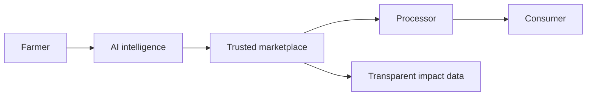
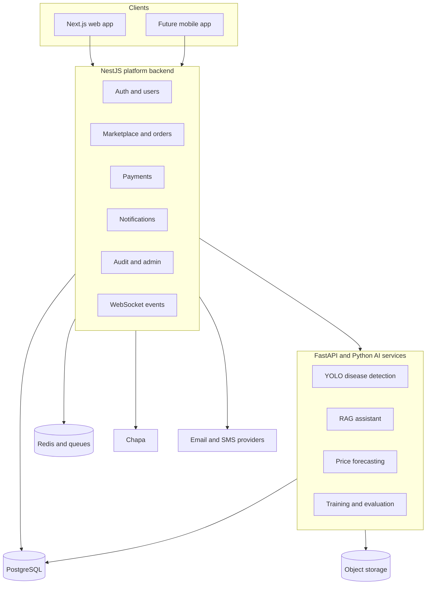

# AgroNexus AI

> **AI for the agricultural value chain in Ethiopia**
>
> Disease intelligence for farmers. Better market decisions. A transparent path from farm to processor.

AgroNexus AI is an AI-native platform concept and working prototype for connecting farmers, processors, and consumers across Ethiopia's agricultural value chain. It combines computer vision, retrieval-augmented generation, forecasting, and secure marketplace workflows in one product direction.

The project is being shaped as a portfolio-grade system with a clear separation of responsibilities:

- **Next.js** for the web experience
- **NestJS** for enterprise business workflows
- **FastAPI/Python** for AI and ML services
- **PostgreSQL, Redis, object storage, and asynchronous workers** for reliable infrastructure

> **Honest status:** the repository currently contains the original FastAPI prototype and Next.js frontend. The NestJS platform backend, Chapa payment flow, and production hardening are documented as the target migration and are not falsely presented as complete.

## Why AgroNexus AI?

Smallholder farmers and agro-processors often lack timely information about crop disease, market prices, quality, and reliable buyers. AgroNexus AI focuses on making those decisions more accessible while preserving a secure, auditable path for real transactions.

## Product vision


```mermaid
flowchart LR
    Farmer[Farmer] --> Intelligence[AI intelligence]
    Intelligence --> Marketplace[Trusted marketplace]
    Marketplace --> Processor[Processor]
    Processor --> Consumer[Consumer]
    Marketplace --> Impact[Transparent impact data]
```

The first target product slice is intentionally narrow:

1. A verified farmer submits a crop image and receives a versioned disease-analysis result.
2. The farmer publishes a product listing.
3. A processor or consumer creates an order.
4. The order is paid through Chapa sandbox verification.
5. Notifications and audit events make the workflow traceable.

That target slice is the implementation goal. The repository currently contains prototype pieces of it, not a tested end-to-end production workflow.

## Capabilities

| Capability | Status | Evidence / next boundary |
|---|---|---|
| Next.js role-based frontend | In Progress | Pages and API calls exist; no automated frontend tests or shared layout |
| FastAPI agricultural routes | In Progress | Route/service surface exists; no automated backend tests |
| YOLO disease detection | In Progress | Model artifacts and inference path exist; fallback can randomize results; no measured evaluation |
| RAG agricultural assistant | In Progress | Gemini/keyword fallback exists; no vector retrieval or populated document store |
| Price and market features | In Progress | Prophet/database route exists; no LSTM execution or evaluation tests |
| Marketplace listings and orders | In Progress | CRUD/status routes exist; payment and ownership hardening remain |
| Authentication and authorization | In Progress - known issue | Public admin registration and order authorization by role name are unresolved |
| Chapa payments | Planned | No provider adapter, sandbox checkout, webhook, or payment endpoint |
| Email/SMS notifications | Planned | No email/SMS provider integration or notification worker |
| Mobile application | Planned | No mobile client or mobile-specific backend implementation |

### Known security issues

- **Public admin registration:** the current registration schema accepts `role=admin`; admin accounts must be provisioned server-side.
- **Order authorization by role name:** the current order-status logic checks role strings such as `buyer`/`seller` instead of enforcing the authenticated user's actual buyer/seller ID.

Both remain **In Progress - known issue** until fixed and covered by tests.

## Architecture


```mermaid
flowchart TB
    subgraph Clients
        WEB[Next.js web app]
        MOBILE[Future mobile app]
    end

    subgraph Platform[NestJS platform backend]
        AUTH[Auth and users]
        MARKET[Marketplace and orders]
        PAY[Payments]
        NOTIFY[Notifications]
        AUDIT[Audit and admin]
        WS[WebSocket events]
    end

    subgraph AI[FastAPI and Python AI services]
        VISION[YOLO disease detection]
        RAG[RAG assistant]
        FORECAST[Price forecasting]
        EVAL[Training and evaluation]
    end

    DB[(PostgreSQL)]
    REDIS[(Redis and queues)]
    STORE[(Object storage)]
    CHAPA[Chapa]
    PROVIDERS[Email and SMS providers]

    WEB --> Platform
    MOBILE --> Platform
    Platform --> DB
    Platform --> REDIS
    Platform --> AI
    Platform --> CHAPA
    Platform --> PROVIDERS
    AI --> DB
    AI --> STORE
```

The browser never calls FastAPI directly. NestJS is the public business boundary; FastAPI is an authenticated internal AI service. Long-running inference, notifications, training, and reconciliation run through queues rather than blocking web requests.

## Documentation

| Document | Purpose |
|---|---|
| [01 - Product Overview](docs/01-product-overview.md) | Product vision, users, zones, boundaries, and success measures |
| [02 - Software Requirements Specification](docs/02-software-requirements-specification.md) | Functional, security, performance, and acceptance requirements |
| [03 - Software Design Specification](docs/03-software-design-specification.md) | Services, modules, APIs, security flows, and integration design |
| [04 - Database Design](docs/04-database-design.md) | Entities, columns, relationships, indexes, and state rules |
| [05 - UI/UX Specification](docs/05-ui-ux-specification.md) | User journeys, accessibility, localization, and frontend security |
| [06 - AI System](docs/06-ai-system.md) | Model lifecycle, RAG, evaluation, MLOps, and AI safety |
| [07 - Testing and Quality Assurance](docs/07-testing-and-quality-assurance.md) | Test pyramid, security tests, quality gates, and release evidence |
| [08 - Deployment and DevOps](docs/08-deployment-and-devops.md) | Environments, containers, CI/CD, secrets, observability, and recovery |
| [09 - Platform Decision Rule](docs/09-platform-decision-rule.md) | Why NestJS and FastAPI coexist and how migration is controlled |

## Repository today

```text
agronexus-ai/
├── backend/              # Current FastAPI prototype and AI/business routes
├── frontend/             # Current Next.js application
├── data/                 # Local datasets and model-related data
├── docs/                 # Product and engineering specifications
├── .github/workflows/    # CI foundation
├── docker-compose.yml    # Local PostgreSQL development services
└── README.md
```

The target migration layout is documented in [03 - Software Design Specification](docs/03-software-design-specification.md). It will be introduced incrementally after API contracts and tests are in place.

## Local development: current prototype

### Prerequisites

- Python 3.11+
- Node.js 18+
- Docker Desktop and Docker Compose
- Git

### Start the database

```bash
docker compose up -d postgres
```

### Run the current FastAPI backend

```bash
cd backend
python -m venv .venv

# Windows PowerShell
.venv\\Scripts\\Activate.ps1

# Git Bash
source .venv/Scripts/activate

pip install -r requirements.txt
uvicorn app.main:app --reload --host 0.0.0.0 --port 8000
```

### Run the Next.js frontend

```bash
cd frontend
npm install
npm run dev
```

Useful local URLs:

- Frontend: `http://localhost:3000`
- Current FastAPI documentation: `http://localhost:8000/docs`
- Current health endpoint: `http://localhost:8000/health`

The current prototype uses local configuration and should not be treated as a production deployment. Do not place real provider keys or personal data in the repository.

## Security direction

The production design requires:

- No public self-registration as `admin`
- Strong startup-validated secrets
- Short-lived access sessions and rotating refresh tokens
- HTTP-only secure cookies for web and Bearer-token support for mobile
- Email verification, password reset, phone OTP, and rate limiting
- Server-side ownership checks for every order and listing action
- Chapa server-to-server payment verification and idempotent webhooks
- Private object storage with signed URLs
- Append-only audit logs and structured redacted logging
- Database migrations instead of production `create_all`

These are engineering requirements, not guarantees provided automatically by FastAPI or NestJS.

## Development roadmap

1. Harden the current authentication and authorization behavior.
2. Add migrations, tests, shared API contracts, and security checks.
3. Implement the NestJS platform backend for identity and marketplace workflows.
4. Keep and formalize FastAPI as the internal AI service.
5. Add Chapa sandbox payments, notification adapters, and reconciliation.
6. Deploy a tested staging slice with observability and rollback.
7. Add mobile and offline capabilities after the public API contract is stable.

## Contributing

Use focused branches and conventional commits. Before opening a pull request:

```text
format -> lint -> type check -> tests -> security scan -> build
```

Changes should update the relevant document when they alter product behavior, security assumptions, data ownership, or deployment configuration.

## Author

**Tsegay Assefa** - AI/ML Engineer and Full-Stack Developer

- GitHub: [@TsegayIS122123](https://github.com/TsegayIS122123)
- LinkedIn: [tsegay-assefa-95a397336](https://linkedin.com/in/tsegay-assefa-95a397336)
- Email: tsegayassefa27@gmail.com

## License

MIT License
