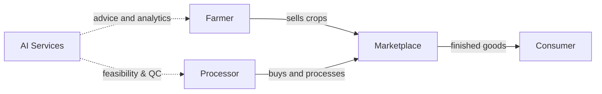
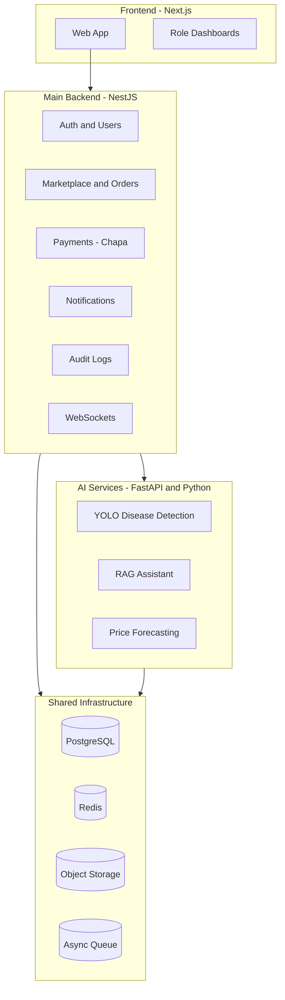

# 01 — Product Overview

> **AgroNexus AI** — AI Operating System for Ethiopia's Agricultural Value Chain
> *From Soil to Shelf — Powered by Artificial Intelligence*

| | |
|---|---|
| **Document** | 01 — Product Overview |
| **Version** | 1.0 |
| **Author** | Tsegay Assefa |
| **Status** | Draft — in review |
| **Last updated** | 2026-09-08 |

---

## 1. Purpose of this document

This is the entry point of the AgroNexus AI documentation suite. It explains **what** the
product is, **who** it serves, **why** it exists, and **what** it will do. It does not go into
technical detail — that belongs to the later documents (02–09).

---

## 2. The product in one paragraph

AgroNexus AI is an AI-powered platform that connects Ethiopian smallholder farmers directly to
agro-processors, industry, and consumers. Farmers get disease detection, price forecasts, and an
AI farming assistant in local languages. Processors get factory feasibility analysis, equipment
sourcing, and automated quality control. Consumers get a transparent marketplace for locally
produced goods. The platform is built as an **enterprise-grade hybrid system**: a NestJS backend
handles business logic (auth, marketplace, orders, payments, notifications, audit), a FastAPI
(Python) service handles all AI/ML workloads, and a Next.js frontend delivers the user experience.

The first complete product slice is intentionally narrow:

> A verified farmer uses AI disease detection and market intelligence, publishes a product listing,
> receives an order, and completes a sandbox payment through Chapa.

That slice proves product value, secure backend engineering, AI engineering, and operational
discipline without claiming that every future feature already exists.

---

## 3. Vision & mission

### 3.1 Vision
> Transform Ethiopia from a raw-material exporter to a higher-value manufacturing hub by making
> agricultural intelligence accessible to every farmer and connecting them directly to industry.

### 3.2 Mission
1. Empower **1 million farmers** with AI tools by 2030.
2. Enable **1,000+ local agro-processors** to manufacture finished goods.
3. Reduce food imports by **$500M** through local substitution.
4. Create **50,000+ jobs** across the agricultural value chain.

---

## 4. The problem

### 4.1 The three gaps

| Gap | The problem | The impact |
|---|---|---|
| **Information gap** | Farmers lack access to market prices, weather data, and expert advice | Decisions are made in the dark; money and harvests are lost |
| **Disease gap** | Without early detection, crop diseases spread unchecked | A large share of harvests is lost each year |
| **Value-chain gap** | Farmers sell to middlemen who capture most of the value | Most of the profit never reaches the farmer |

### 4.2 Why now
- Ethiopia imports **$2B+** of food every year that could be produced locally.
- Factories operate at roughly **40% capacity** because they cannot source reliable raw material.
- Smartphone penetration among farmers is growing; mobile money (Telebirr, CBE Birr, Amole) is
  mainstream — making digital payments and information delivery viable.

---

## 5. The solution

### 5.1 What the platform does

| Zone | Who it serves | Core capabilities |
|---|---|---|
| **Farmer Zone** | Smallholder farmers | Disease detection (photo), AI assistant (Amharic/Oromo/Tigrinya/English), price forecasts, weather alerts, cooperative formation |
| **Industry Zone** | Agro-processors | Factory feasibility analysis, equipment sourcing, quality-control AI, cost/ROI calculator, energy optimization |
| **Market Zone** | Farmers, processors, consumers | B2B marketplace listings, orders, secure payments (Chapa), order tracking, reviews, price comparison |
| **Admin Zone** | Platform Admin | User management, roles/permissions, moderation, audit logs, impact dashboards |

### 5.2 The actors (who uses the system)

| Actor | Description | Primary functions |
|---|---|---|
| **Farmer** | Individual or cooperative member who produces crops and sells them on the marketplace | Register/verify account; diagnose crop disease from a photo; chat with the AI assistant; view forecast and weather; publish listings; view/follow orders; receive notifications; request human review of low-confidence AI results |
| **Processor** | Agro-industry actor who buys raw crops, processes them, and sells finished goods | Register/verify account; search listings; assess quality; run feasibility analysis; place orders; track orders; receive notifications; access their own audit-relevant events |
| **Consumer** | End buyer of locally produced goods | Browse listings; view product details; check available stock; place orders where enabled; track orders; access their own profile |
| **Platform Admin** | Human platform operator with management and moderation rights | Manage users; moderate listings; view orders and payments; view audit logs; change roles (audit-logged); suspend users; review AI results flagged for human attention |
| **System/AI** | Non-human automation: AI models, workers, notification jobs, payment webhooks, scheduled jobs | Generate AI inferences; persist results; fan out notifications; verify payment webhooks; enforce rate limits; emit audit events; never exercise human admin privileges by default |

### 5.3 The value chain in one diagram

---

## 6. System architecture at a glance

The **NestJS backend is the single entry point for the frontend**. AI capability is *never*
called directly by the browser; the frontend asks NestJS, and NestJS calls the FastAPI AI
service internally (see `03-software-design-specification.md` for the contract).

---

## 7. Key features by zone

### 7.1 Farmer Zone

| Feature | Description | Technology |
|---|---|---|
| Crop disease detection | Upload a photo → instant diagnosis + treatment advice | YOLOv8 (FastAPI) |
| AI farming assistant | Ask questions in Amharic, Oromo, Tigrinya, English | RAG + LLM (FastAPI) |
| Price prediction | 30-day forecasts with confidence intervals | Prophet / LSTM (FastAPI) |
| Weather alerts | 5-day hyperlocal forecasts | OpenWeather API |
| Cooperative hub | Connect with nearby farmers | Recommendation logic |

### 7.2 Industry Zone

| Feature | Description | Technology |
|---|---|---|
| Factory feasibility | Assess crop-to-product manufacturing viability | Decision engine (FastAPI) |
| Equipment sourcing | Match buyers with local equipment sellers | Marketplace |
| Quality-control AI | Automated export-standard product grading | Computer vision (FastAPI) |
| Cost calculator | Manufacturing cost and ROI analysis | NestJS service |
| Energy optimization | Solar/biofuel recommendations | Optimization logic |

### 7.3 Market Zone

| Feature | Description | Technology |
|---|---|---|
| B2B marketplace | Direct farmer↔processor connections | NestJS + PostgreSQL |
| Orders & tracking | Full order lifecycle with status transitions | NestJS + WebSockets |
| Secure payments | Chapa checkout, webhook verification, refunds | Chapa (sandbox → live) |
| Reviews | Post-delivery ratings between trading partners | NestJS |
| Price comparison | Local vs imported price data | Data pipeline |

### 7.4 Cross-cutting

| Capability | Description |
|---|---|
| Authentication | Email + password, email verification, SMS OTP, refresh tokens |
| Authorization | Role-based access control (farmer / processor / consumer / admin) |
| Notifications | Email (Resend), SMS (Telnyx), in-app (WebSocket) |
| Audit logging | Immutable trail of sensitive actions |
| Payments | Chapa with idempotency and webhook signature verification |

---

## 8. Scope

### 8.1 In scope (Phase 1 — MVP)

- Authentication & profiles (all four roles)
- Farmer Zone: disease detection, assistant, price forecast, weather
- Industry Zone: feasibility, quality grading, equipment marketplace
- Market Zone: listings, orders, Chapa payments (sandbox), reviews
- Notifications (email + SMS), audit logs, admin basics
- Tests, CI/CD, deployment (staging + production)

### 8.2 Out of scope (later phases)

- Native mobile app (the API is mobile-ready from day one)
- SMS-only (feature-phone) interface
- Blockchain provenance, carbon credits, crop insurance
- Voice interface in local languages

### 8.3 Deliberate boundaries — must not be called complete in Phase 1

- Native mobile application
- Production SMS provider integration
- Voice assistant
- Multi-country payments
- Blockchain provenance
- Government analytics portal
- Autonomous agronomic recommendations without human review

---

## 9. Success metrics (KPIs)

| Metric | Target |
|---|---|
| Disease detection accuracy | mAP@0.5 > 0.85 |
| Price forecast error | MAPE < 15% |
| AI assistant response time | < 2 seconds |
| API availability | 99.9% |
| Test coverage (backend) | > 80% |
| Time to first order on marketplace | < 5 minutes |

---

## 10. Roadmap

| Phase | Duration | Goal |
|---|---|---|
| **Phase 1 — MVP** | ~3 months | Farmer + Industry + Market core with secure payments |
| **Phase 2 — Full** | ~6 months | Admin dashboards, impact tracker, advanced notifications |
| **Phase 3 — Advanced** | ~12 months | Mobile app, SMS interface, voice, insurance/provenance pilots |

---

## 11. Document map

| Doc | Title | Contents |
|---|---|---|
| 01 | Product Overview | This document: vision, users, zones, boundaries, KPIs, roadmap |
| 02 | Software Requirements Specification | Actors, functions, use cases, FR/NFR requirements, acceptance criteria |
| 03 | Software Design Specification | Architecture, modules, class diagram, API contracts, security design |
| 04 | Database Design | Entities, tables, columns, indexes, Redis & storage layout |
| 05 | UI/UX Specification | User journeys, accessibility, localization, frontend security |
| 06 | AI System | Model specs, training, evaluation, serving, MLOps, AI safety |
| 07 | Testing & QA | Test strategy, coverage targets, CI gates, release evidence |
| 08 | Deployment & DevOps | Environments, CI/CD, infrastructure, monitoring, recovery |
| 09 | Platform Decision Rule | Why NestJS + FastAPI + Next.js; alternatives considered |

---

## 12. Actor capability summary

For quick reference, the next document expands each actor into detailed functions and use cases.
This table is the summary.

| Actor | Can register | Can verify | Can create listings | Can create orders | Can process payments | Can use AI | Can view audit |
|---|---|---|---|---|---|---|---|
| Farmer | yes | email + phone | yes | yes (buyer) | yes (buyer) | yes | no (their own only) |
| Processor | yes | email + phone | yes | yes (buyer) | yes (buyer) | yes | no (their own only) |
| Consumer | yes | email | no | yes (buyer) | yes (buyer) | no | no |
| Platform Admin | only provisioned | email | yes (admin-owned) | yes | yes | yes | yes (platform-wide) |
| System/AI | no | no | no | no | webhook receiver | inference producer | yes (own events) |
