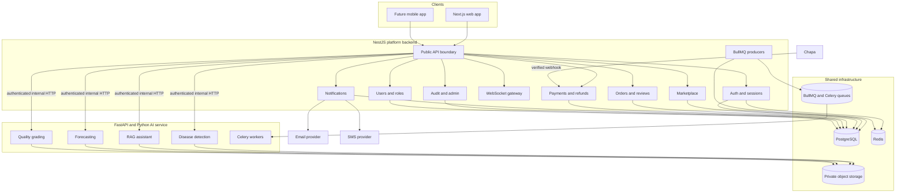
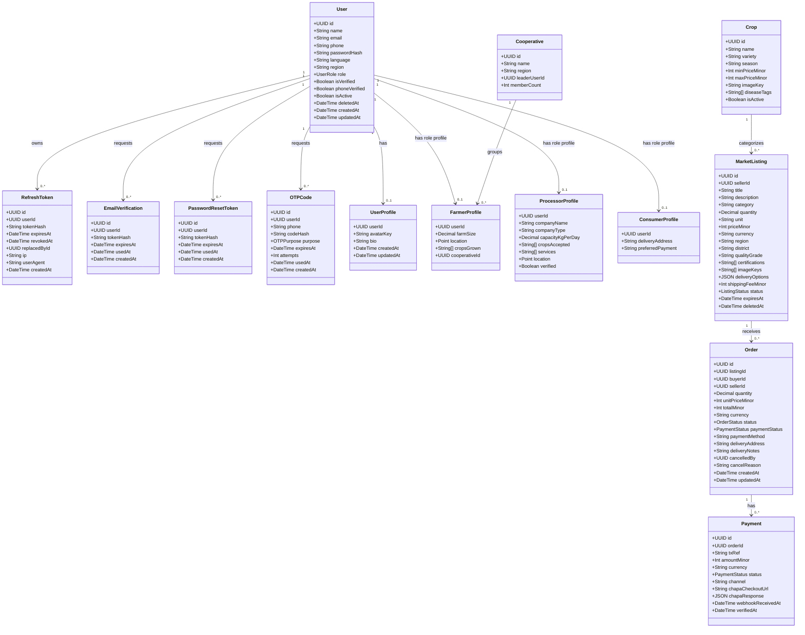
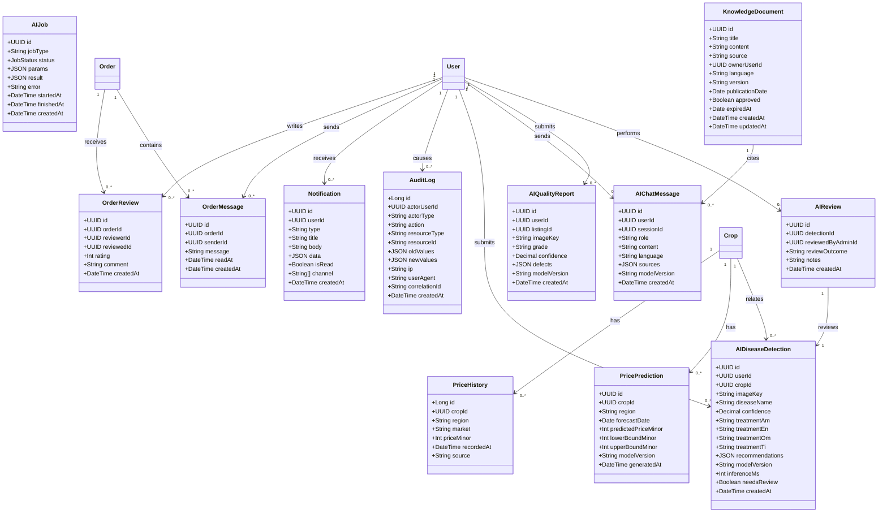
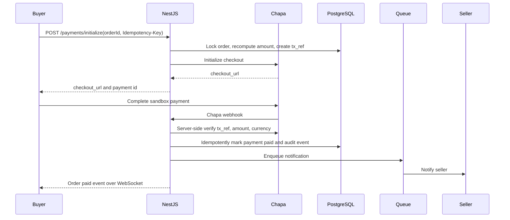
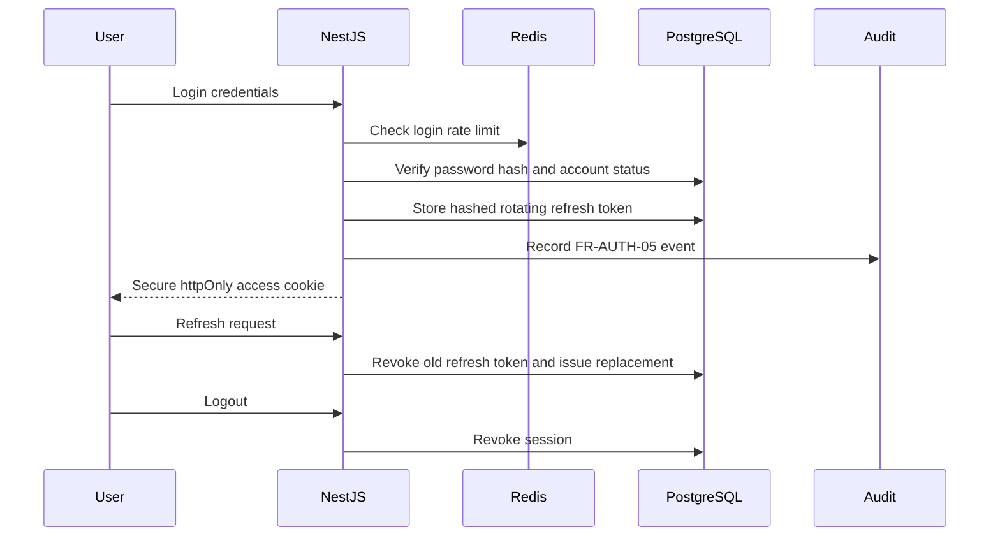
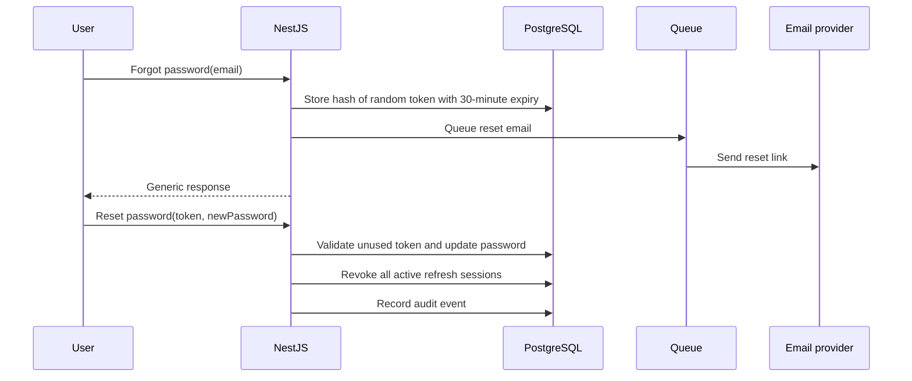

# 03 - Software Design Specification (SDS)

> AgroNexus AI - How the system is built: architecture, modules, class model, API contracts, and security design.

| | |
|---|---|
| **Document** | 03 - Software Design Specification |
| **Version** | 1.1 |
| **Author** | Tsegay Assefa |
| **Status** | Draft - in review |
| **Last updated** | 2026-09-09 |

---

## 1. Design goals

1. **AI-native but enterprise-solid:** Python owns AI; NestJS owns business rules.
2. **Security by default:** authentication, RBAC, rate limiting, webhook verification, and audit trails are explicit.
3. **Mobile-ready:** the public API supports web cookies and mobile Bearer tokens.
4. **Traceable:** every public operation maps to a requirement ID, owner module, and test.
5. **Incrementally scalable:** start with a modular NestJS backend and a separate FastAPI AI service; split further only when an operational reason exists.

## 2. High-level architecture



**Boundary rule:** the browser and future mobile app call NestJS only. FastAPI is private and receives authenticated internal requests from NestJS or approved workers. Chapa, email, and SMS are external providers; their payloads never become trusted business state without verification.

**Current web authentication choice:** the web backend sets the short-lived access token as an `HttpOnly` cookie named `access_token`; authorization reads that same cookie. The cookie uses `SameSite=Lax`, and `COOKIE_SECURE=true` enables the `Secure` flag for HTTPS staging/production. The response body may still expose the token for the current prototype's mobile compatibility, but browser authorization is cookie-based. Bearer-token support remains a future mobile contract.

## 3. Runtime and repository layout

```text
agronexus-ai/
├── frontend/                  # Next.js and TypeScript user experience
├── backend/                   # NestJS platform backend after migration
│   ├── src/modules/
│   │   ├── auth/
│   │   ├── users/
│   │   ├── marketplace/
│   │   ├── orders/
│   │   ├── payments/
│   │   ├── notifications/
│   │   ├── audit/
│   │   ├── websocket/
│   │   └── ai-gateway/
│   ├── src/common/            # guards, validation, errors, logging
│   └── prisma/                # schema and migrations
├── ai/                        # FastAPI and Python AI service after migration
│   ├── app/api/
│   ├── app/services/
│   ├── app/models/
│   ├── app/workers/
│   └── tests/
├── docs/
└── infra/
```

The current repository contains the earlier FastAPI prototype under `backend/`. Migration is incremental and follows [09 - Platform Decision Rule](09-platform-decision-rule.md); the directory comments above describe the target ownership, not current implementation status.

## 4. Domain model

The diagrams below are intentionally split. **Part 1** shows identity and transactional entities. **Part 2** shows activity, governance, and AI entities. Each class represents either a persisted entity or a domain object whose behavior belongs to the owning module. The field names must match the tables in [04 - Database Design](04-database-design.md).

### 4.1 Class diagram - Part 1: account, profiles, catalog, listing, order, payment



### 4.2 Class diagram - Part 2: order activity, governance, and AI/ML



### 4.3 How to read the class diagrams

- A class with a matching table in `04` is a persisted entity. Its fields must match the database column contract.
- A method or service behavior belongs in the owning module; it is not automatically a database column.
- `UserProfile` is optional shared profile data. `FarmerProfile`, `ProcessorProfile`, and `ConsumerProfile` reference `users.id` directly, matching the database design.
- `AIReview` is a review record created only for a flagged result. One detection may have multiple review events; the latest valid outcome is the current moderation state.
- The diagrams explain ownership and relationships; they are not a replacement for API authorization or database constraints.

## 5. Domain responsibility by module

| Domain concept | Owning module | Primary responsibility | Requirement trace |
|---|---|---|---|
| User, RefreshToken, EmailVerification, PasswordResetToken, OTPCode | Auth | Registration, verification, sessions, reset, token hashing, throttling | FR-AUTH-01...FR-AUTH-05 |
| UserProfile, FarmerProfile, ProcessorProfile, ConsumerProfile, Cooperative | Users | Profiles, role extensions, cooperative membership, ownership checks | FR-USER-01...FR-USER-04 |
| Crop, MarketListing | Marketplace | Catalog, listings, search, listing lifecycle | FR-MARKET-01...FR-MARKET-05 |
| Order, OrderReview, OrderMessage | Orders | Order creation, quantity locking, state machine, reviews, order chat | FR-ORDER-01...FR-ORDER-05, FR-WS-02 |
| Payment | Payments | Chapa initialization, verification, idempotency, refunds | FR-PAY-01...FR-PAY-06 |
| Notification | Notifications | Email, SMS, in-app delivery, templates, retry policy | FR-NOTIF-01...FR-NOTIF-03 |
| AuditLog | Audit | Append-only security and business trail | FR-AUDIT-01...FR-AUDIT-02 |
| AIDiseaseDetection, AIChatMessage, PricePrediction, AIQualityReport, AIJob | AI Gateway + FastAPI | Inference, chat, forecasts, grading, training jobs, model metadata | FR-AI-01...FR-AI-08 |
| KnowledgeDocument | Knowledge Base | Approved, versioned, expiring retrieval sources | FR-KB-01...FR-KB-03 |
| AIReview | Admin + AI | Human review queue and correction outcomes | FR-ADMIN-01, FR-AI-06...FR-AI-08 |

## 6. Module design

### 6.1 Auth and Users

- `AuthController`: register, login, refresh, logout, forgot-password, reset-password, verify-email, request-OTP, verify-OTP.
- `AuthService`: bcrypt password hashing, token creation and rotation, generic errors, rate limits.
- `UsersService`: profiles, role extensions, account status, admin-provisioned role changes.
- Guards: `JwtAuthGuard`, `RolesGuard`, ownership guard, and throttling guard.

### 6.2 Marketplace and Orders

- Marketplace owns listing validation, pagination, expiry, and seller ownership.
- Orders owns server-side totals, inventory/quantity locking, state transitions, reviews, and order messages.
- Order events are published to the notification queue and WebSocket gateway after the transaction commits.

### 6.3 Payments

- `ChapaProvider` implements `PaymentsProvider`: `initialize`, `verify`, and `refund`.
- Payment state changes are keyed by `tx_ref`, validated against the order amount and currency, and applied idempotently.
- Browser redirects are informational; server-to-server verification is authoritative.

### 6.4 Notifications and Audit

- Notification providers implement email, SMS, and in-app delivery behind one interface.
- Delivery is queued, retried with bounded backoff, and recorded.
- Audit events are append-only, redacted, correlation-aware, and created by user, webhook, or system actors.

### 6.5 AI Gateway and FastAPI

- NestJS validates user authorization, quotas, and public DTOs before forwarding to FastAPI.
- FastAPI validates the internal service credential, input limits, model availability, and output schema.
- Results include model version, confidence, latency, timestamp, and review status.
- Long-running training and batch inference use workers, not request threads.

## 7. API design

### 7.1 Conventions

- Base path: `/api/v1`.
- Responses use `{ success, data }` or `{ success: false, error: { code, message } }`.
- Every request accepts or receives an `X-Correlation-ID`; the ID is propagated internally.
- Use bounded pagination and UUID public identifiers.
- Use `Idempotency-Key` for payment initialization and other retryable commands.
- Use cookies for the web client and `Authorization: Bearer` for mobile clients.

### 7.2 Public API surface

| Method | Endpoint | Auth | Requirements |
|---|---|---|---|
| POST | `/api/v1/auth/register` | public | FR-AUTH-01 |
| POST | `/api/v1/auth/login` | public | FR-AUTH-03 |
| POST | `/api/v1/auth/refresh` | refresh session | FR-AUTH-03 |
| POST | `/api/v1/auth/logout` | authenticated | FR-AUTH-03, FR-AUTH-05 |
| POST | `/api/v1/auth/forgot-password` | public | FR-AUTH-04, FR-AUTH-05 |
| POST | `/api/v1/auth/reset-password` | reset token | FR-AUTH-04 |
| POST | `/api/v1/auth/verify-email` | verification token | FR-AUTH-02, FR-AUTH-05 |
| POST | `/api/v1/auth/request-otp` | authenticated | FR-AUTH-02, FR-NOTIF-01 |
| POST | `/api/v1/auth/verify-otp` | authenticated | FR-AUTH-02, FR-NOTIF-01 |
| GET/PUT | `/api/v1/users/me` | authenticated | FR-USER-01, FR-USER-03 |
| GET | `/api/v1/marketplace/listings` | public | FR-MARKET-02, PERF-002 |
| POST | `/api/v1/marketplace/listings` | farmer/processor | FR-MARKET-01 |
| PUT | `/api/v1/marketplace/listings/:id` | owner/admin | FR-MARKET-03, FR-USER-03 |
| POST | `/api/v1/orders` | buyer | FR-ORDER-01, FR-ORDER-02 |
| GET | `/api/v1/orders` | authenticated | FR-ORDER-04 |
| PATCH | `/api/v1/orders/:id/status` | buyer/seller | FR-ORDER-03, FR-ORDER-04 |
| POST | `/api/v1/orders/:id/review` | buyer/seller | FR-ORDER-05 |
| POST | `/api/v1/payments/initialize` | buyer | FR-PAY-01, FR-PAY-02, FR-PAY-06 |
| POST | `/api/v1/payments/webhook/chapa` | provider | FR-PAY-03, FR-SYS-02 |
| GET | `/api/v1/payments/:orderId` | buyer/seller | FR-PAY-05, FR-ORDER-04 |
| POST | `/api/v1/ai/disease/detect` | farmer | FR-AI-01, FR-AI-06 |
| POST | `/api/v1/ai/chat` | farmer | FR-AI-02, FR-KB-01, FR-KB-02, FR-KB-03 |
| GET | `/api/v1/ai/prices/forecast` | farmer/processor | FR-AI-03, FR-AI-06 |
| POST | `/api/v1/ai/quality/grade` | processor | FR-AI-04, FR-AI-06 |
| POST | `/api/v1/admin/ai-reviews` | Platform Admin | FR-ADMIN-01, FR-AI-07, FR-AI-08 |
| GET | `/api/v1/admin/audit-logs` | Platform Admin | FR-ADMIN-01, FR-AUDIT-01, FR-AUDIT-02 |

### 7.3 Internal NestJS to FastAPI contract

| Method | Path | Purpose | Requirements |
|---|---|---|---|
| POST | `/internal/ai/v1/detect` | Disease detection | FR-AI-01, FR-AI-06 |
| POST | `/internal/ai/v1/chat` | RAG chat | FR-AI-02, FR-KB-01...FR-KB-03 |
| GET | `/internal/ai/v1/forecast` | Price forecast | FR-AI-03, FR-AI-06 |
| POST | `/internal/ai/v1/grade` | Quality grading | FR-AI-04, FR-AI-06 |
| POST | `/internal/ai/v1/feasibility` | Feasibility analysis | FR-AI-04, FR-AI-06 |

Internal contracts are versioned OpenAPI contracts and are tested independently of the public API.

### 7.4 Payment sequence



## 8. Security design

### 8.1 Authentication sequence



### 8.2 Password reset sequence



### 8.3 Security control traceability

| Layer | Control | Requirements |
|---|---|---|
| Transport | HTTPS, HSTS, secure cookies | SEC-001 |
| Secrets | Environment/secret manager, secret scanning | SEC-002, SEC-009 |
| Passwords and sessions | bcrypt, hashed tokens, rotation, revocation | SEC-003, FR-AUTH-03 |
| Abuse prevention | Login, OTP, reset, and API rate limits | SEC-004 |
| Validation | DTO validation at frontend, NestJS, and FastAPI boundaries | SEC-005 |
| Browser security | CSP, XSS defenses, SameSite cookies, CSRF where needed | SEC-006 |
| Payments | Signature verification, server-side amount checks, idempotency | SEC-007, FR-PAY-02, FR-PAY-03, FR-PAY-06 |
| Uploads | Size, type, magic-byte checks, private bucket, signed URLs | SEC-008 |
| Authorization | RBAC plus resource ownership checks | FR-USER-02, FR-USER-03 |
| Audit | Append-only events with actor and correlation ID | FR-AUDIT-01, FR-AUDIT-02 |

## 9. Errors, logging, and observability

- A global exception filter returns stable error codes such as `VALIDATION_ERROR`, `UNAUTHORIZED`, `FORBIDDEN`, `NOT_FOUND`, `CONFLICT`, `PAYMENT_FAILED`, and `RATE_LIMITED`.
- Structured logs use JSON and correlation IDs.
- Logs never contain passwords, raw tokens, provider secrets, or unnecessary personal data.
- Metrics cover HTTP latency, WebSocket connections, queue depth, payment verification, notification delivery, and AI inference.
- Health endpoints separate process liveness from dependency readiness.

## 10. Testing hooks

- Every module exposes services behind interfaces so unit tests can mock external dependencies.
- NestJS/FastAPI contract tests validate request and response schemas.
- Payment providers are mocked in unit tests and exercised in sandbox integration tests.
- Authorization tests cover every ownership boundary.
- Every public endpoint maps to acceptance criteria in `02`.

## 11. Deployment summary

| Component | Initial hosting shape | Scaling rule |
|---|---|---|
| Next.js | Managed frontend or container | Scale independently from APIs |
| NestJS | Stateless container service | Horizontal replicas behind a load balancer |
| FastAPI | Private container service, GPU optional | Scale inference workers independently |
| PostgreSQL | Managed PostgreSQL | Read replicas/partitioning only when measured |
| Redis | Managed Redis | Separate cache and queue capacity when needed |
| Object storage | Private S3-compatible bucket | Signed URLs and lifecycle policies |
| Workers | BullMQ/Celery processes | Scale by queue depth and job type |

Detailed environment, CI/CD, recovery, and monitoring rules are defined in [08 - Deployment and DevOps](08-deployment-and-devops.md).
