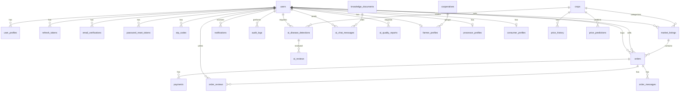

# 04 — Database Design

> AgroNexus AI — Every entity, table, and column in the system, with clear definitions.
> Covers PostgreSQL (source of truth), Redis (fast data), and object storage (files).

| | |
|---|---|
| **Document** | 04 — Database Design |
| **Version** | 1.0 |
| **Author** | Tsegay Assefa |
| **Status** | Draft — in review |
| **Last updated** | 2026-09-08 |

---

## 1. Design principles

1. **PostgreSQL is the source of truth** for all business data.
2. **Every table has `id` (UUID), `created_at`, `updated_at`** unless stated otherwise.
3. **Money is stored in integer minor units (cents of ETB)** — 1 ETB = 100 minor units. Floats
   are never used for money.
4. **Soft deletes** (`deleted_at`) for user and marketplace data.
5. **Sensitive tokens are stored hashed** (SHA-256), never plaintext.
6. **Redis holds only ephemeral data** (rate limits, OTPs, cache) — it can be wiped safely.
7. **Files live in object storage**; the database stores only keys and metadata.
8. **Enums are string values** for readability and safe migration.
9. **Every request has a correlation ID** that is stored in audit events for tracing across
   NestJS and FastAPI.

---

## 2. Data ownership by store

| Store | What lives there | Lifetime |
|---|---|---|
| **PostgreSQL** | All entities below | Permanent |
| **Redis** | Rate-limit counters, OTP codes, refresh-token denylist, cached reads (categories, regions, forecasts), BullMQ/Celery job state | Ephemeral |
| **Object storage** | Disease photos, listing images, product images, export documents | Permanent |

---

## 3. Entity-relationship diagram



---

## 4. Tables — detailed column definitions

> Legend — PK: primary key · FK: foreign key · UQ: unique · IDX: indexed (non-unique).
> Implementation note — this section is the column-level contract for the PostgreSQL schema.
> For each table, the diagram in section 3, the class diagram in 03, and this column table should 
> describe the same entity with the same names and the same optional/required story.
> All money columns are integer minor units (1 ETB = 100 minor units).

### 4.1 `users` — every account on the platform

| Column | Type | Null | Default | Description |
|---|---|---|---|---|
| id | UUID | no | gen_random_uuid() | PK |
| name | VARCHAR(255) | no | — | Full name |
| email | VARCHAR(255) | no | — | Login email (UQ, lowercase, unique) |
| phone | VARCHAR(20) | no | — | Ethiopian phone, `+251…` or `09…` (UQ) |
| password_hash | VARCHAR(255) | no | — | bcrypt hash — plaintext never stored |
| language | VARCHAR(10) | no | `am` | UI language: `am`, `om`, `ti`, `en` |
| region | VARCHAR(100) | yes | — | Home region (IDX) |
| role | user_role | no | `farmer` | Enum: `farmer`, `processor`, `consumer`, `admin` |
| is_verified | BOOLEAN | no | `false` | Email verified? Gates full access (IDX) |
| phone_verified | BOOLEAN | no | `false` | Phone verified via OTP |
| is_active | BOOLEAN | no | `true` | Soft-disable by admin |
| deleted_at | TIMESTAMPTZ | yes | — | Soft delete marker |
| created_at | TIMESTAMPTZ | no | now() | Row created |
| updated_at | TIMESTAMPTZ | no | now() | Row updated |

**Indexes:** `email` (UQ), `phone` (UQ), `role`, `is_verified`, `region`.

### 4.2 `refresh_tokens` — revocable sessions

| Column | Type | Null | Default | Description |
|---|---|---|---|---|
| id | UUID | no | gen_random_uuid() | PK |
| user_id | UUID | no | — | FK → users.id (IDX) |
| token_hash | VARCHAR(64) | no | — | SHA-256 of refresh token (UQ) — never stored raw |
| expires_at | TIMESTAMPTZ | no | — | Revoked/expired when in the past |
| revoked_at | TIMESTAMPTZ | yes | — | Set on logout/rotation |
| replaced_by_id | UUID | yes | — | Self-FK: rotation chain |
| ip | INET | yes | — | IP at issue (audit aid) |
| user_agent | TEXT | yes | — | Device info |
| created_at | TIMESTAMPTZ | no | now() | Row created |

**Indexes:** `token_hash` (UQ), `user_id`, `expires_at`.

### 4.3 `email_verifications` — verify-email tokens

| Column | Type | Null | Default | Description |
|---|---|---|---|---|
| id | UUID | no | gen_random_uuid() | PK |
| user_id | UUID | no | — | FK → users.id (IDX) |
| token_hash | VARCHAR(64) | no | — | SHA-256 of raw link token (UQ) |
| expires_at | TIMESTAMPTZ | no | — | 24 h after creation |
| used_at | TIMESTAMPTZ | yes | — | Set when consumed |
| created_at | TIMESTAMPTZ | no | now() | Row created |

### 4.4 `password_reset_tokens` — forgot/reset password

| Column | Type | Null | Default | Description |
|---|---|---|---|---|
| id | UUID | no | gen_random_uuid() | PK |
| user_id | UUID | no | — | FK → users.id (IDX) |
| token_hash | VARCHAR(64) | no | — | SHA-256 of raw reset token (UQ) |
| expires_at | TIMESTAMPTZ | no | — | 30 min after creation |
| used_at | TIMESTAMPTZ | yes | — | Set when consumed |
| created_at | TIMESTAMPTZ | no | now() | Row created |

### 4.5 `otp_codes` — SMS one-time passwords (logged for audit; live check in Redis)

| Column | Type | Null | Default | Description |
|---|---|---|---|---|
| id | UUID | no | gen_random_uuid() | PK |
| user_id | UUID | no | — | FK → users.id (IDX) |
| phone | VARCHAR(20) | no | — | Destination number |
| code_hash | VARCHAR(64) | no | — | SHA-256 of the 6-digit code (UQ) |
| purpose | otp_purpose | no | — | `phone_verify`, `login`, `password_reset` |
| expires_at | TIMESTAMPTZ | no | — | 5 min |
| attempts | SMALLINT | no | 0 | Failed attempts; max 5 |
| used_at | TIMESTAMPTZ | yes | — | Set when consumed |
| created_at | TIMESTAMPTZ | no | now() | Row created |

### 4.6 `user_profiles` — role-neutral profile row (1:1 with users)

| Column | Type | Null | Default | Description |
|---|---|---|---|---|
| user_id | UUID | no | — | PK + FK → users.id |
| avatar_key | VARCHAR(255) | yes | — | Object-storage key of avatar |
| bio | TEXT | yes | — | Short self-description |
| created_at | TIMESTAMPTZ | no | now() | Row created |
| updated_at | TIMESTAMPTZ | no | now() | Row updated |

### 4.7 `farmer_profiles` — farmer-specific data (1:1 with user_profiles)

In implementation, `farmer_profiles` is a role extension keyed by `user_id`, even though the
visual model says "extends user_profiles". It is easier to maintain one FK to `users` than a
chain of joins.

| Column | Type | Null | Default | Description |
|---|---|---|---|---|
| user_id | UUID | no | — | PK + FK → users.id |
| farm_size | DECIMAL(10,2) | yes | — | Hectares |
| location | GEOGRAPHY(POINT) | yes | — | Lat/lng (PostGIS) |
| crops_grown | TEXT[] | no | `{}` | Crop names |
| cooperative_id | UUID | yes | — | FK → cooperatives.id |
| created_at | TIMESTAMPTZ | no | now() | Row created |
| updated_at | TIMESTAMPTZ | no | now() | Row updated |

### 4.8 `processor_profiles` — processor-specific data (1:1 with user_profiles)

| Column | Type | Null | Default | Description |
|---|---|---|---|---|
| user_id | UUID | no | — | PK + FK → users.id |
| company_name | VARCHAR(255) | no | — | Registered name |
| company_type | VARCHAR(50) | yes | — | `washing_station`, `mill`, `factory` |
| capacity_kg_per_day | DECIMAL(12,2) | yes | — | Processing capacity |
| crops_accepted | TEXT[] | no | `{}` | Crops the processor buys |
| services | TEXT[] | yes | — | `washing`, `drying`, `roasting`, `packaging` |
| location | GEOGRAPHY(POINT) | yes | — | Lat/lng |
| verified | BOOLEAN | no | `false` | Admin-verified (IDX) |
| created_at | TIMESTAMPTZ | no | now() | Row created |
| updated_at | TIMESTAMPTZ | no | now() | Row updated |

### 4.9 `consumer_profiles` — consumer-specific data (1:1 with user_profiles)

| Column | Type | Null | Default | Description |
|---|---|---|---|---|
| user_id | UUID | no | — | PK + FK → users.id |
| delivery_address | TEXT | yes | — | Default address |
| preferred_payment | VARCHAR(50) | yes | — | `telebirr`, `cbe`, `amole`, `card` |
| created_at | TIMESTAMPTZ | no | now() | Row created |
| updated_at | TIMESTAMPTZ | no | now() | Row updated |

### 4.10 `cooperatives` — farmer groups

| Column | Type | Null | Default | Description |
|---|---|---|---|---|
| id | UUID | no | gen_random_uuid() | PK |
| name | VARCHAR(255) | no | — | Cooperative name (UQ) |
| region | VARCHAR(100) | no | — | Region (IDX) |
| leader_user_id | UUID | yes | — | FK → users.id (leader) |
| member_count | INTEGER | no | 0 | Denormalized counter |
| created_at | TIMESTAMPTZ | no | now() | Row created |
| updated_at | TIMESTAMPTZ | no | now() | Row updated |

### 4.11 `crops` — crop catalog (market reference data)

| Column | Type | Null | Default | Description |
|---|---|---|---|---|
| id | UUID | no | gen_random_uuid() | PK |
| name | VARCHAR(100) | no | — | e.g. `teff` (UQ) |
| variety | VARCHAR(100) | yes | — | e.g. `white`, `red` |
| season | VARCHAR(50) | yes | — | Growing season |
| min_price_minor | INTEGER | yes | — | Reference min price, minor units |
| max_price_minor | INTEGER | yes | — | Reference max price, minor units |
| image_key | VARCHAR(255) | yes | — | Object-storage key |
| disease_tags | TEXT[] | yes | — | Known diseases |
| is_active | BOOLEAN | no | `true` | Catalog visibility |
| created_at | TIMESTAMPTZ | no | now() | Row created |
| updated_at | TIMESTAMPTZ | no | now() | Row updated |

### 4.12 `market_listings` — what sellers offer

| Column | Type | Null | Default | Description |
|---|---|---|---|---|
| id | UUID | no | gen_random_uuid() | PK |
| seller_id | UUID | no | — | FK → users.id (IDX) |
| title | VARCHAR(255) | no | — | Listing title |
| description | TEXT | yes | — | Free text |
| category | VARCHAR(100) | no | — | `crop`, `processed`, `equipment` (IDX) |
| subcategory | VARCHAR(100) | yes | — | Finer classification |
| quantity | DECIMAL(12,2) | no | — | Available amount |
| unit | VARCHAR(20) | no | `kg` | `kg`, `ton`, `piece`, `liter` |
| price_minor | INTEGER | no | — | Price per unit, minor units (IDX) |
| currency | CHAR(3) | no | `ETB` | ISO code |
| region | VARCHAR(100) | no | — | Seller region (IDX) |
| district | VARCHAR(100) | yes | — | District |
| quality_grade | VARCHAR(50) | yes | — | `A`, `B`, `C`, `Premium`, `Standard` |
| certifications | TEXT[] | yes | — | `organic`, `fair-trade`, … |
| image_keys | TEXT[] | yes | — | Object-storage keys |
| delivery_options | JSONB | yes | — | `{"pickup": true, "delivery": false}` |
| shipping_fee_minor | INTEGER | yes | 0 | Optional delivery fee from seller, minor units |
| status | listing_status | no | `active` | `active`, `pending`, `sold`, `expired`, `cancelled` (IDX) |
| expires_at | TIMESTAMPTZ | yes | — | Auto-expiry |
| deleted_at | TIMESTAMPTZ | yes | — | Soft delete |
| created_at | TIMESTAMPTZ | no | now() | Row created |
| updated_at | TIMESTAMPTZ | no | now() | Row updated |

**Indexes:** `seller_id`, `category`, `region`, `status`, `price_minor`, `created_at DESC`.

### 4.13 `orders` — buyer–seller transactions

| Column | Type | Null | Default | Description |
|---|---|---|---|---|
| id | UUID | no | gen_random_uuid() | PK |
| listing_id | UUID | no | — | FK → market_listings.id (IDX) |
| buyer_id | UUID | no | — | FK → users.id (IDX) |
| seller_id | UUID | no | — | FK → users.id (IDX) |
| quantity | DECIMAL(12,2) | no | — | Ordered amount |
| unit_price_minor | INTEGER | no | — | Price per unit at order time (snapshot) |
| total_minor | INTEGER | no | — | quantity × unit price, server-computed |
| currency | CHAR(3) | no | `ETB` | ISO code |
| status | order_status | no | `pending` | See state machine below (IDX) |
| payment_status | payment_status | no | `pending` | `pending`, `paid`, `failed`, `refunded` (IDX) |
| payment_method | VARCHAR(50) | yes | — | `telebirr`, `cbe`, `amole`, `card` |
| delivery_address | TEXT | yes | — | Buyer address |
| delivery_notes | TEXT | yes | — | Free text |
| cancelled_by | UUID | yes | — | FK → users.id |
| cancel_reason | TEXT | yes | — | Why cancelled |
| created_at | TIMESTAMPTZ | no | now() | Row created |
| updated_at | TIMESTAMPTZ | no | now() | Row updated |
| confirmed_at | TIMESTAMPTZ | yes | — | Status event timestamps |
| shipped_at | TIMESTAMPTZ | yes | — | — |
| delivered_at | TIMESTAMPTZ | yes | — | — |
| cancelled_at | TIMESTAMPTZ | yes | — | — |

**Order status machine:** `pending → confirmed → processing → shipped → delivered`;
`pending/confirmed/processing/shipped → cancelled` (cancel allowed until shipped).

**Note:** if delivery can be paid separately in a future phase, add `shipping_fee_minor` to the
order so the total can include delivery. For Phase 1, delivery cost is kept in the listing's
`shipping_fee_minor` and applied at order creation.

### 4.14 `payments` — Chapa transactions (one or more per order)

| Column | Type | Null | Default | Description |
|---|---|---|---|---|
| id | UUID | no | gen_random_uuid() | PK |
| order_id | UUID | no | — | FK → orders.id (IDX) |
| tx_ref | VARCHAR(100) | no | — | Chapa reference (UQ) — idempotency key |
| amount_minor | INTEGER | no | — | Amount paid, minor units |
| currency | CHAR(3) | no | `ETB` | ISO code |
| status | payment_status | no | `pending` | `pending`, `paid`, `failed`, `refunded` (IDX) |
| channel | VARCHAR(50) | yes | — | `telebirr`, `cbe`, `amole`, `card` |
| chapa_checkout_url | TEXT | yes | — | Redirect URL from Chapa |
| chapa_response | JSONB | yes | — | Raw provider response (debug) |
| webhook_received_at | TIMESTAMPTZ | yes | — | Webhook timestamp |
| verified_at | TIMESTAMPTZ | yes | — | When we confirmed the payment |
| created_at | TIMESTAMPTZ | no | now() | Row created |
| updated_at | TIMESTAMPTZ | no | now() | Row updated |

### 4.15 `order_reviews` — post-delivery ratings

| Column | Type | Null | Default | Description |
|---|---|---|---|---|
| id | UUID | no | gen_random_uuid() | PK |
| order_id | UUID | no | — | FK → orders.id |
| reviewer_id | UUID | no | — | FK → users.id (IDX) |
| reviewed_id | UUID | no | — | FK → users.id — the other party |
| rating | SMALLINT | no | — | 1–5 |
| comment | TEXT | yes | — | Free text |
| created_at | TIMESTAMPTZ | no | now() | Row created |

**Constraint:** one active review per (`order_id`, `reviewer_id`) pair.

### 4.16 `order_messages` — order chat (WebSocket)

| Column | Type | Null | Default | Description |
|---|---|---|---|---|
| id | UUID | no | gen_random_uuid() | PK |
| order_id | UUID | no | — | FK → orders.id (IDX) |
| sender_id | UUID | no | — | FK → users.id |
| message | TEXT | no | — | Content |
| read_at | TIMESTAMPTZ | yes | — | When recipient read it |
| created_at | TIMESTAMPTZ | no | now() | Row created |

### 4.17 `notifications` — in-app notifications

| Column | Type | Null | Default | Description |
|---|---|---|---|---|
| id | UUID | no | gen_random_uuid() | PK |
| user_id | UUID | no | — | FK → users.id (IDX) |
| type | VARCHAR(50) | no | — | `order.paid`, `order.shipped`, `review.received`, … |
| title | VARCHAR(255) | no | — | Short title |
| body | TEXT | no | — | Message text |
| data | JSONB | yes | — | Structured payload (orderId, …) |
| is_read | BOOLEAN | no | `false` | Read flag (IDX) |
| channel | TEXT[] | no | `{inapp}` | Where it was delivered: `inapp`, `email`, `sms` |
| created_at | TIMESTAMPTZ | no | now() | Row created |

### 4.18 `audit_logs` — append-only security trail

| Column | Type | Null | Default | Description |
|---|---|---|---|---|
| id | BIGSERIAL | no | — | PK (monotonic) |
| actor_user_id | UUID | yes | — | FK → users.id (null = system) (IDX) |
| actor_type | VARCHAR(20) | no | — | `user`, `system`, `webhook` |
| action | VARCHAR(100) | no | — | e.g. `auth.login`, `order.status.change` (IDX) |
| resource_type | VARCHAR(100) | no | — | `order`, `user`, `listing`, `payment` |
| resource_id | VARCHAR(64) | yes | — | Target record id |
| old_values | JSONB | yes | — | Before state (sensitive fields redacted) |
| new_values | JSONB | yes | — | After state |
| ip | INET | yes | — | Client IP |
| user_agent | TEXT | yes | — | Client UA |
| correlation_id | VARCHAR(128) | no | — | Request trace propagated across services |
| created_at | TIMESTAMPTZ | no | now() | Row created |

**Indexes:** `actor_user_id`, `action`, `created_at`. **No UPDATE/DELETE allowed.**

### 4.19 `ai_disease_detections` — vision results

| Column | Type | Null | Default | Description |
|---|---|---|---|---|
| id | UUID | no | gen_random_uuid() | PK |
| user_id | UUID | no | — | FK → users.id (IDX) |
| crop_id | UUID | yes | — | FK → crops.id |
| image_key | VARCHAR(255) | no | — | Object-storage key |
| disease_name | VARCHAR(255) | no | — | Predicted class (IDX) |
| confidence | DECIMAL(5,4) | no | — | 0–1 |
| treatment_am | TEXT | yes | — | Treatment — Amharic |
| treatment_en | TEXT | yes | — | Treatment — English |
| treatment_om | TEXT | yes | — | Treatment — Oromo |
| treatment_ti | TEXT | yes | — | Treatment — Tigrinya |
| recommendations | JSONB | yes | — | Action list |
| model_version | VARCHAR(50) | yes | — | Which model served this |
| inference_ms | INTEGER | yes | — | Latency (monitoring) |
| needs_review | BOOLEAN | no | `false` | Flagged for human review |
| created_at | TIMESTAMPTZ | no | now() | Row created |

### 4.20 `ai_chat_messages` — RAG assistant history

| Column | Type | Null | Default | Description |
|---|---|---|---|---|
| id | UUID | no | gen_random_uuid() | PK |
| user_id | UUID | no | — | FK → users.id (IDX) |
| session_id | UUID | no | — | Groups a conversation (IDX) |
| role | VARCHAR(10) | no | — | `user` or `assistant` |
| content | TEXT | no | — | Message text |
| language | VARCHAR(10) | no | `am` | Request language |
| sources | JSONB | yes | — | RAG source references (document IDs + excerpts) |
| model_version | VARCHAR(50) | yes | — | Model used |
| created_at | TIMESTAMPTZ | no | now() | Row created |

### 4.21 `price_history` — time-series market prices

| Column | Type | Null | Default | Description |
|---|---|---|---|---|
| id | BIGSERIAL | no | — | PK |
| crop_id | UUID | no | — | FK → crops.id (IDX) |
| region | VARCHAR(100) | no | — | Region (IDX) |
| market | VARCHAR(100) | yes | — | Specific market |
| price_minor | INTEGER | no | — | Price, minor units |
| recorded_at | TIMESTAMPTZ | no | — | When observed (IDX) |
| source | VARCHAR(50) | yes | — | `api`, `scraper`, `manual` |

**Note:** table is partitioned by month for growth (or TimescaleDB hypertable if adopted).

### 4.22 `price_predictions` — AI forecast outputs

| Column | Type | Null | Default | Description |
|---|---|---|---|---|
| id | UUID | no | gen_random_uuid() | PK |
| crop_id | UUID | no | — | FK → crops.id (IDX) |
| region | VARCHAR(100) | no | — | Region (IDX) |
| forecast_date | DATE | no | — | Day being predicted (UQ with crop + region) |
| predicted_price_minor | INTEGER | no | — | Predicted price, minor units |
| lower_bound_minor | INTEGER | no | — | Confidence lower bound |
| upper_bound_minor | INTEGER | no | — | Confidence upper bound |
| model_version | VARCHAR(50) | no | — | Model used |
| generated_at | TIMESTAMPTZ | no | now() | Batch timestamp |

**Unique constraint:** `(crop_id, region, forecast_date)` — one forecast per crop, region, and
day.

### 4.23 `ai_quality_reports` — quality-control grading

| Column | Type | Null | Default | Description |
|---|---|---|---|---|
| id | UUID | no | gen_random_uuid() | PK |
| user_id | UUID | no | — | FK → users.id (IDX) |
| listing_id | UUID | yes | — | FK → market_listings.id |
| image_key | VARCHAR(255) | no | — | Object-storage key |
| grade | VARCHAR(20) | no | — | `export`, `grade_a`, `grade_b`, `reject` |
| confidence | DECIMAL(5,4) | no | — | 0–1 |
| defects | JSONB | yes | — | Detected defects |
| model_version | VARCHAR(50) | yes | — | Model used |
| created_at | TIMESTAMPTZ | no | now() | Row created |

### 4.24 `ai_jobs` — long-running AI task ledger (training, batch inference)

| Column | Type | Null | Default | Description |
|---|---|---|---|---|
| id | UUID | no | gen_random_uuid() | PK |
| job_type | VARCHAR(100) | no | — | `train.disease`, `forecast.refresh`, … (IDX) |
| status | job_status | no | `queued` | `queued`, `running`, `succeeded`, `failed`, `cancelled` (IDX) |
| params | JSONB | yes | — | Job input |
| result | JSONB | yes | — | Job output |
| error | TEXT | yes | — | Failure message |
| started_at | TIMESTAMPTZ | yes | — | — |
| finished_at | TIMESTAMPTZ | yes | — | — |
| created_at | TIMESTAMPTZ | no | now() | Row created |

### 4.25 `knowledge_documents` — curated RAG source materials

| Column | Type | Null | Default | Description |
|---|---|---|---|---|
| id | UUID | no | gen_random_uuid() | PK |
| title | VARCHAR(255) | no | — | Document title |
| content | TEXT | no | — | Plain text source for retrieval |
| source | VARCHAR(100) | no | — | Where the content came from |
| owner_user_id | UUID | yes | — | FK → users.id (optional contributor/admin) |
| language | VARCHAR(10) | no | `am` | Language of the content |
| version | VARCHAR(50) | no | — | Content version for tracking changes |
| publication_date | DATE | no | — | When the content is considered published |
| approved | BOOLEAN | no | `false` | Approved for production use (IDX) |
| expired_at | DATE | yes | — | When retrieval should stop using this content |
| created_at | TIMESTAMPTZ | no | now() | Row created |
| updated_at | TIMESTAMPTZ | no | now() | Row updated |

> For a vector-backed search, chunk this content into a separate `knowledge_chunks` table or an
> external vector store. For Phase 1, this table is the source of truth for approved documents,
> and the retrieval layer reads from it. Retrieval must only use approved and non-expired
> documents, matching FR-KB-02.

### 4.26 `ai_reviews` — human review queue for low-confidence AI results

| Column | Type | Null | Default | Description |
|---|---|---|---|---|
| id | UUID | no | gen_random_uuid() | PK |
| detection_id | UUID | yes | — | FK → ai_disease_detections.id (IDX) |
| reviewed_by_admin_id | UUID | no | — | FK → users.id — the admin who reviewed it |
| review_outcome | VARCHAR(50) | no | — | e.g. `confirmed`, `corrected`, `escalated` |
| notes | TEXT | yes | — | Admin notes |
| created_at | TIMESTAMPTZ | no | now() | Row created |

> This table makes human review explicit in the database. It implements FR-AI-07 and FR-AI-08.
> If a detection is not flagged, no row is created here. The relationship is 
> `ai_disease_detections ||--o{ ai_reviews` in the ER diagram and the class diagram.

---

## 5. Enum definitions

```sql
CREATE TYPE user_role       AS ENUM ('farmer', 'processor', 'consumer', 'admin');
CREATE TYPE otp_purpose     AS ENUM ('phone_verify', 'login', 'password_reset');
CREATE TYPE listing_status  AS ENUM ('active', 'pending', 'sold', 'expired', 'cancelled');
CREATE TYPE order_status    AS ENUM ('pending', 'confirmed', 'processing', 'shipped', 'delivered', 'cancelled');
CREATE TYPE payment_status  AS ENUM ('pending', 'paid', 'failed', 'refunded');
CREATE TYPE job_status      AS ENUM ('queued', 'running', 'succeeded', 'failed', 'cancelled');
```

---

## 6. Redis key layout

| Key pattern | TTL | Purpose |
|---|---|---|
| `rl:{scope}:{identifier}` | 60 s | Rate-limit counters (login, OTP, API) |
| `otp:{user_id}:{purpose}` | 5 min | Live OTP code (DB copy is the audit record) |
| `cache:regions` / `cache:categories` | 1 h | Hot listing facets |
| `cache:forecast:{crop}:{region}` | 12 h | Forecast results |
| `denylist:refresh:{token_hash}` | until expiry | Revoked refresh tokens |
| `bullmq:*` / `celery:*` | — | Job queues and state |

---

## 7. Object storage layout

```text
agronexus/
├── avatars/{userId}/{uuid}.{ext}
├── diseases/{userId}/{uuid}.{ext}        # uploaded crop photos
├── listings/{listingId}/{uuid}.{ext}     # listing images
├── quality/{userId}/{uuid}.{ext}         # grading photos
└── exports/{userId}/{uuid}.pdf           # future documents
```

- Bucket is **private**; files are served via **short-lived signed URLs**.
- Uploads are validated: allowed types (`jpg`, `png`, `webp`), ≤ 5 MB, magic-byte check.

---

## 8. Migration strategy

1. **Prisma Migrations** manage the PostgreSQL schema (all tables above), applied in CI and
   before every deploy (`prisma migrate deploy`).
2. **Seed scripts** load reference data: crops, regions, categories, demo users.
3. **Migration from the legacy FastAPI schema** (v1): a one-time mapping script imports
   users, listings, and orders into the new schema, then the old tables are dropped.
4. **Backups:** nightly `pg_dump` to object storage; point-in-time recovery enabled in prod.

---

## 9. Consistency rules (enforced in code)

| Rule | Where enforced |
|---|---|
| Order total always recomputed server-side from listing price | `OrdersService` |
| A listing with an active order cannot be deleted (only deactivated) | `MarketplaceService` |
| One active review per (order, reviewer) pair | unique index |
| Payment status transitions: pending → paid/failed; paid → refunded | `PaymentService` |
| Refund requires a paid order and is idempotent on `tx_ref` | `PaymentService` |
| AI results must not auto-execute sensitive order/payment actions from unverified detections | `AIDetectionService` + transaction layer |
| Cancel requires buyer/seller + not yet shipped | `OrderStateMachine` |
| Refresh token rotation invalidates the previous token | `TokenService` |
| Only approved and non-expired knowledge documents are retrieved | retrieval layer |
| Low-confidence detections are written with `needs_review = true` and surfaced to admins | `AIDetectionService` + admin review queue |

---

## 10. Implementation quick reference

| Concept | Where to implement it |
|---|---|
| Money arithmetic | All price/total columns are integer minor units; use integer math, not floats |
| Correlation trace | Propagate one correlation ID per request; store it in `audit_logs` and log lines |
| Append-only audit | No UPDATE/DELETE on `audit_logs`; use INSERT only |
| Soft deletes | Use `deleted_at` on users and listings; add `deleted_at IS NULL` filters in queries |
| Token hashing at rest | SHA-256 hash login/rese/refresh/OTP tokens before storing; compare hashed values |
| Idempotent payments | Key payment updates on `tx_ref`; duplicate webhooks must not change state twice |
| Human review of AI | Store `needs_review` on detections; expose `ai_reviews` to admins; do not auto-act on flagged results |
| Knowledge retrieval safety | Filter retrieval by `approved = true` and `expired_at IS NULL`; refuse to answer if no approved source |
