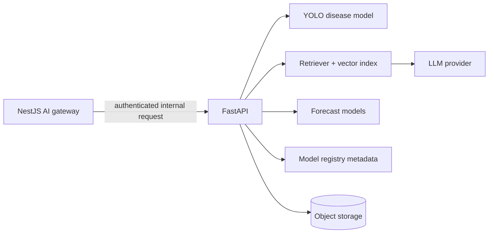
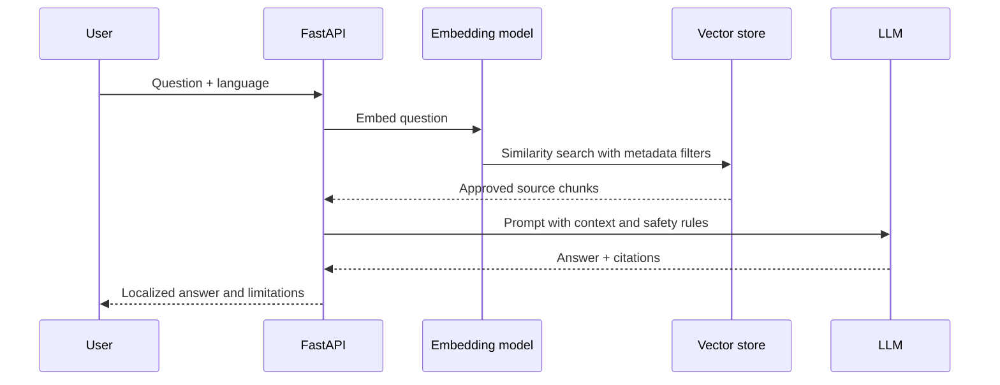

# 06 — AI System Specification

> AgroNexus AI — Model, data, evaluation, retrieval, and production inference design.

## 1. AI engineering principles

1. A model prediction is evidence for a decision, not an unquestionable truth.
2. Every result records model version, input metadata, latency, confidence, and timestamp.
3. Training data, evaluation data, and production data are separated.
4. Low-confidence or safety-sensitive results have a human escalation path.
5. Prompt, retrieval, and model changes are evaluated before release.

## 2. AI service boundary

FastAPI/Python owns model loading, preprocessing, inference, RAG orchestration, training jobs, evaluation, and model metadata. NestJS owns authentication, quotas, user-facing API contracts, persistence of business results, and authorization.



## 3. Disease detection

### Pipeline

1. Validate authenticated request, file size, MIME type, and image magic bytes.
2. Store the original in a private object-storage location.
3. Normalize image dimensions and color space.
4. Run YOLO inference with a pinned model version.
5. Apply confidence and quality thresholds.
6. Return label, confidence, bounding boxes where applicable, treatment guidance, and limitation text.
7. Persist the inference run and enqueue human review when required.

### Evaluation

- Report precision, recall, F1, mAP@0.5, confusion matrix, and per-class results.
- Split evaluation by crop, disease, geography, lighting, and image quality where data allows.
- Never claim production accuracy from training accuracy.
- Include an explicit `unknown` or `needs_review` outcome.

## 4. RAG agricultural assistant

### Retrieval pipeline



Knowledge documents must have source, owner, language, version, publication date, and approval status. Retrieval filters out unapproved or expired content. If evidence is insufficient, the assistant must say so instead of inventing treatment advice.

### Prompt controls

- Keep system instructions separate from user content.
- Treat retrieved documents as reference material, not executable instructions.
- Defend against prompt injection in documents and user messages.
- Limit output length and external tool access.
- Log prompt version and retrieval IDs without storing unnecessary personal data.

## 5. Price forecasting

- Inputs: historical price, crop, region, market, season, and approved weather features.
- Models: establish a naive baseline first, then compare Prophet, LSTM, or an ensemble.
- Evaluation: rolling time-series backtesting, MAE, RMSE, MAPE, and interval coverage.
- Output: forecast horizon, point estimate, confidence interval, model version, data freshness, and warning when history is insufficient.
- Retraining: scheduled job with dataset snapshot and reproducible configuration.

## 6. Quality grading and feasibility

Quality grading must expose the standard or rubric used, input quality, confidence, and whether the result is suitable only for screening. Certification decisions remain with qualified people or institutions. Feasibility results must show assumptions, inputs, formulas, and sensitivity rather than presenting a single opaque recommendation.

## 7. MLOps lifecycle

```text
Collect -> validate -> label -> split -> train -> evaluate -> register
  -> approve -> deploy -> monitor -> review -> retrain
```

Required artifacts:

- Dataset version and license/source record
- Training configuration and random seed
- Model artifact checksum
- Evaluation report
- Model card with intended use and limitations
- Deployment record and rollback version

## 8. AI safety and observability

- Reject unsafe file types and oversized inputs.
- Apply per-user quotas and request timeouts.
- Track latency, error rate, token usage, retrieval hit rate, confidence distribution, and drift indicators.
- Do not expose API keys or raw provider errors.
- Provide a feedback action that records correction data separately from ground truth.
