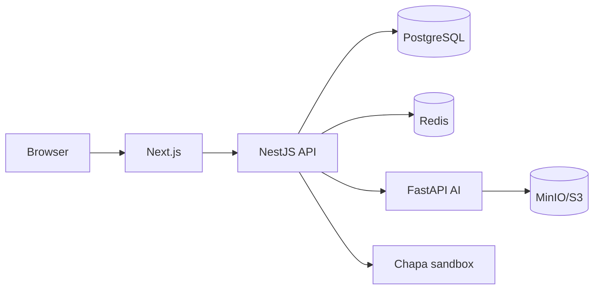

# 08 — Deployment and DevOps

## 1. Environments

| Environment | Purpose | Integrations |
|---|---|---|
| Local | Development and experiments | Docker services, fake/log-only notifications, Chapa sandbox |
| Staging | Shared QA and portfolio demonstration | Managed-like services, sandbox providers, seeded test data |
| Production | Real users and money | Managed secrets, live providers only after approval |

Configuration is environment-specific. Production secrets never come from the repository or Docker image.

## 2. Local service topology



The current repository contains the original FastAPI prototype. The NestJS and `ai/` layout in the design documents is the target migration shape; deployment status must be updated as implementation progresses.

## 3. Container rules

- Use a production image without hot reload.
- Run as a non-root user.
- Pin base images and dependency lockfiles.
- Add health and readiness checks.
- Keep model artifacts in versioned storage or an image layer intentionally, not in ad-hoc mutable paths.
- Do not include `.env`, development keys, datasets containing personal data, or build caches in images.

## 4. CI/CD pipeline

```text
pull request
  -> format/lint/type checks
  -> unit/integration/contract tests
  -> security and dependency scan
  -> frontend build and container build
  -> migration validation

merge to develop -> deploy staging -> smoke tests
merge to main -> approval -> deploy production -> health check -> monitor
```

Deployments must be traceable to a commit. Migrations run as an explicit release step and are never silently performed by application startup.

## 5. Secrets and configuration

Required secret categories include database credentials, JWT signing keys, cookie configuration, Chapa keys, email/SMS keys, LLM keys, object-storage credentials, and internal service credentials.

- Validate configuration at startup.
- Use a secret manager in staging/production.
- Rotate credentials without rebuilding application logic.
- Keep sandbox and production provider credentials separate.
- Add secret scanning to CI and revoke any exposed key immediately.

## 6. Observability

- Structured JSON logs with correlation IDs.
- Metrics for request latency, errors, queue depth, webhook processing, notification delivery, and AI inference.
- Distributed traces across Next.js, NestJS, FastAPI, and queues where practical.
- Alerts for payment verification failures, repeated authentication failures, queue backlog, and model error spikes.
- Logs exclude passwords, tokens, full payment secrets, and unnecessary personal data.

## 7. Recovery

- Automated PostgreSQL backups with tested restore procedures.
- Object-storage versioning for important artifacts.
- Queue retry and dead-letter handling.
- Documented rollback for application, migration, and model versions.
- Incident runbook for leaked secrets, fraudulent payment events, data loss, and model regression.

## 8. Deployment acceptance checklist

- HTTPS and secure headers enabled
- Correct CORS and cookie domains configured
- Database migration succeeds on a clean database
- Readiness checks fail when required dependencies are unavailable
- Sandbox/live provider mode is explicit
- Smoke test completes register-to-payment verification
- Monitoring and rollback target are known
